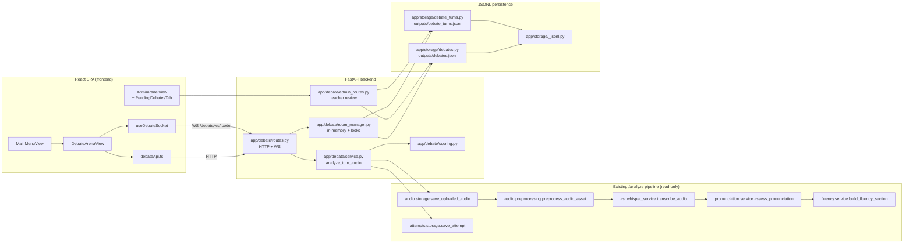
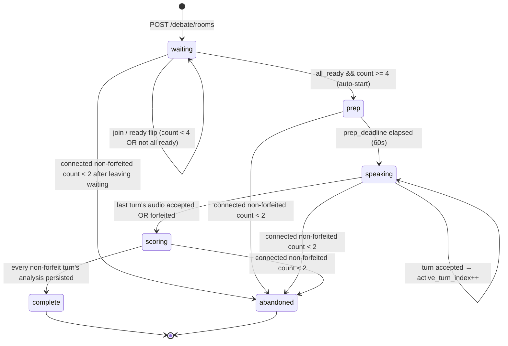
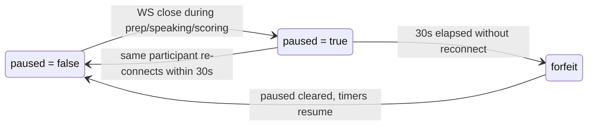

# Design Document

## Overview

Group Debate ek naya multi-player mode hai jahan 4–6 authenticated students ek shared 6-char room code ke through ek Debate_Room me judte hain, ek shared 60s Prep_Phase ke baad round-robin turn order me har participant apni 120s (+15s grace) speaking turn record karta hai, aur har turn ke audio par existing `/analyze` pipeline chalti hai. Highest Effective_Score wala participant winner declare hota hai, aur teachers har turn ka score override kar sakte hain.

### Reuse strategy

- **`/analyze` pipeline reuse (Requirement 5.3, 16.4)**: `app/api/analysis_routes.py::analyze_audio` ek FastAPI route hai, aur non-modification constraint (Req 16.1) ke wajah se hum us function ko na to modify kar sakte hain, na hi HTTP se self-call karna acceptable hai. Design choice: **duplicate the ~40-line orchestration inline in `app/debate/service.py::analyze_turn_audio`**, jo bilkul same order me existing helper functions call karega (`save_uploaded_audio` → `preprocess_audio_asset` → `transcribe_audio` → `assess_pronunciation` → `build_fluency_section`), aur `AnalyzeResponse` bhi construct karega. Yeh design ka trade-off explicit hai:
  - **Pro**: Existing `analyze_audio` route, uske callees, aur `AnalyzeResponse` schema untouched (Req 16.4 satisfied).
  - **Con**: 40 lines of orchestration duplicated. Preferred alternative (extracting a shared helper) rejected because it would edit `app/api/analysis_routes.py`.
  - **Con**: If pipeline order changes upstream, debate service must be updated in lock-step. Mitigated by pinning imports to the same downstream modules (`app.asr.whisper_service`, `app.audio.preprocessing`, etc.).

- **Attempt persistence**: `analyze_audio` bhi `save_attempt(...)` call karta hai jo `outputs/attempts.jsonl` me write karta hai. Debate turn ke inline pipeline me hum bhi wahi `save_attempt(...)` call karenge, taaki analysis_id both stores me consistently show ho (existing attempts store shared ho sakta hai, kyunki `app/attempts/storage.py` non-modification list me nahi hai — hum sirf existing function ko call kar rahe hain, module ko edit nahi kar rahe).

- **New backend module** (`app/debate/`): `__init__.py`, `routes.py`, `room_manager.py`, `schemas.py`, `service.py`, `scoring.py`. Structure `app/battles/` ke exactly parallel hai.

- **New storage**: `app/storage/debates.py` (debate room + final record), `app/storage/debate_turns.py` (per-turn records). Dono `app/storage/_jsonl.py` ke `append_jsonl` / `read_jsonl` / `overwrite_jsonl` primitives ke upar built hain (Req 15.1, 15.2).

- **Admin sub-router**: Requirement 16.2 ke honor ke liye — `app/admin/routes.py` ko edit nahi karenge. Instead: **new file `app/debate/admin_routes.py`** create karenge jo debate-specific `/admin/debates/*` endpoints expose karega, aur usko `app/api/routes.py` me additive registration ke through mount karenge (existing `admin_router` ke saath side-by-side, `app.include_router(debate_admin_router)`). Trade-off: `/admin/debates` prefix under a different router file hai, but same URL space se serve hoti hai — teacher clients ke liye transparent.

- **New frontend**: `frontend/src/debateApi.ts`, `frontend/src/hooks/useDebateSocket.ts`, `frontend/src/components/DebateArenaView.tsx`, aur `frontend/src/components/admin/debates/` (PendingDebatesList, DebateReviewPanel). Additive touches: `MainMenuView.tsx` me new tile, `App.tsx` me new view state, `AdminPanelView.tsx` me new tab, `vite.config.ts` me new `/debate` proxy entry.

## Architecture



## Room State Machine

### Primary states



Note: Requirement 7.1 explicitly names `ready` as an implicit sub-state of `waiting` — the room's `state` field never becomes literally `"ready"`; it stays `"waiting"` while ready flips propagate, and jumps straight to `"prep"` when the auto-start condition fires. We keep `"ready"` reserved only as a conceptual sub-state name in the API for parity with the requirements text, but the persisted / broadcast state string is one of `waiting | prep | speaking | scoring | complete | abandoned`.

### Orthogonal `paused` overlay

`paused` is not a primary state — it is a boolean flag on `PublicDebateRoom` that overlays on top of `prep | speaking | scoring`. Broadcast shape includes both fields, e.g. `{state: "speaking", paused: true, reconnect_deadline: 1700000030.5}`.



### Server-enforced deadlines (all wall-clock)

| Phase | Trigger | Duration | Field on `PublicDebateRoom` | On elapse |
|---|---|---|---|---|
| Prep | Auto-start into `prep` | 60s | `prep_deadline` | Transition to `speaking`, active_turn_index = 0 |
| Turn | Enter `speaking` OR `active_turn_index++` | 120s + 15s grace = 135s | `turn_deadline` | Mark current turn as Forfeit (ai_score=0, forfeit_reason="timeout"), advance active_turn_index |
| Reconnect grace | Participant WS close during prep/speaking/scoring | 30s | `reconnect_deadline` | Mark participant `is_forfeit=true`, clear `paused`, cancel any pending/upcoming turn for them, advance if they were the active speaker |

### Full transition table (trigger → side effect)

| From | Trigger | To | Side effects |
|---|---|---|---|
| `waiting` | `POST /rooms/{code}/join` (count < 6) | `waiting` | Append participant, broadcast |
| `waiting` | `POST /rooms/{code}/ready` (all ready && count≥4) | `prep` | Set `prep_deadline = now+60`, broadcast, spawn prep timer |
| `waiting` | Ready flip (not all ready) | `waiting` | Toggle flag, broadcast |
| `prep` | prep_deadline elapsed | `speaking` | active_turn_index=0, set `turn_deadline=now+135`, broadcast, spawn turn timer |
| `speaking` | `POST /turn` accepted, not last speaker | `speaking` | Persist turn, active_turn_index++, reset turn_deadline, broadcast |
| `speaking` | `POST /turn` accepted, last speaker | `scoring` | Persist turn, wait for outstanding analyses (already sync in this design), broadcast |
| `speaking` | Turn timer elapsed | `speaking` or `scoring` | Persist forfeit turn (ai_score=0, forfeit_reason="timeout"), advance turn index or move to `scoring` if last |
| `scoring` | All non-forfeit turn records persisted | `complete` | Compute winner, persist `DebateRecord`, broadcast, close timers |
| `prep|speaking|scoring` | WS close for participant P | (same) + `paused=true` | Set `reconnect_deadline=now+30`, pause turn timer, broadcast |
| paused | Same P reconnects within 30s | (same) + `paused=false` | Clear reconnect_deadline, resume turn timer with remaining budget, broadcast |
| paused | 30s elapsed | (same) + `paused=false` | Mark P `is_forfeit=true`; if P was active speaker, persist forfeit turn (forfeit_reason="reconnect_timeout") and advance |
| Any non-terminal | connected non-forfeit count < 2 | `abandoned` | Broadcast, close timers, do NOT persist final record |

## Data Models

All schemas live in `app/debate/schemas.py` and are Pydantic v2 (matching the rest of the codebase).

### Internal (server-only)

```python
class ParticipantInternal(BaseModel):
    participant_id: str        # uuid4 hex[:16]
    user_id: str               # firebase uid
    user_email: str            # NOT included in public projection
    display_name: str
    joined_at: float           # unix seconds
    is_ready: bool = False
    turn_index: int            # assigned in join order on entry into speaking
    is_forfeit: bool = False
    ws_connected_since: Optional[float] = None
    # Set when WS closes; None while connected.
    disconnected_at: Optional[float] = None


class DebateRoom(BaseModel):
    """Authoritative in-memory server state."""
    debate_id: str                      # uuid4
    code: str                           # 6-char room code
    motion_id: str
    motion_title: str
    motion_text: str
    state: Literal["waiting", "prep", "speaking", "scoring", "complete", "abandoned"] = "waiting"
    paused: bool = False
    participants: list[ParticipantInternal] = Field(default_factory=list)
    active_turn_index: Optional[int] = None
    prep_deadline: Optional[float] = None
    turn_deadline: Optional[float] = None
    reconnect_deadline: Optional[float] = None
    created_at: float
    completed_at: Optional[float] = None
    winner_participant_id: Optional[str] = None
    # Cumulative pause offset for the currently active turn (used when
    # resuming after paused overlay so the deadline is extended by
    # the paused duration).
    _pause_started_at: Optional[float] = None
```

### Public / broadcast projection

```python
class ParticipantPublic(BaseModel):
    participant_id: str
    display_name: str
    is_ready: bool
    turn_index: int
    is_forfeit: bool


class MotionPublic(BaseModel):
    id: str
    title: str
    text: str


class PublicDebateRoom(BaseModel):
    """Broadcast shape — NEVER exposes emails, WS handles, uids."""
    code: str
    state: Literal["waiting", "prep", "speaking", "scoring", "complete", "abandoned"]
    paused: bool = False
    motion: Optional[MotionPublic] = None
    participants: list[ParticipantPublic] = Field(default_factory=list)
    active_turn_index: Optional[int] = None
    prep_deadline: Optional[float] = None
    turn_deadline: Optional[float] = None
    reconnect_deadline: Optional[float] = None
    winner_participant_id: Optional[str] = None
```

### Persisted (JSONL rows)

```python
class DebateTurn(BaseModel):
    turn_id: str                        # uuid4
    debate_id: str
    participant_id: str
    turn_index: int
    analysis_id: Optional[str] = None   # links to /analyze pipeline output
    ai_score: float                     # 0..100, clamped
    scoring_unavailable: bool = False
    teacher_override_score: Optional[int] = None   # 0..100 inclusive
    teacher_comment: Optional[str] = None
    submitted_at: float                 # unix seconds
    forfeit_reason: Optional[Literal["timeout", "reconnect_timeout"]] = None


class EffectiveScoreEntry(BaseModel):
    participant_id: str
    ai_score: float
    teacher_override_score: Optional[int] = None
    effective_score: float


class DebateRecord(BaseModel):
    debate_id: str
    code: str
    motion_id: str
    motion_title: str
    motion_text: str
    participants: list[dict]            # snapshot: participant_id, user_id, display_name, turn_index, is_forfeit
    turn_ids: list[str]                 # ordering by turn_index
    winner_participant_id: Optional[str] = None
    effective_scores: list[EffectiveScoreEntry] = Field(default_factory=list)
    created_at: float
    completed_at: float
```

### Motion catalog

```python
class Motion(BaseModel):
    id: str
    title: str
    text: str
```

### Request / response shapes

```python
class CreateRoomResponse(BaseModel):
    room_code: str
    participant_id: str
    state: PublicDebateRoom


class JoinRoomResponse(BaseModel):
    room_code: str
    participant_id: str
    state: PublicDebateRoom


class ReadyResponse(BaseModel):
    state: PublicDebateRoom


class TurnUploadResponse(BaseModel):
    turn_id: str
    ai_score: float
    scoring_unavailable: bool
    analysis_id: Optional[str]
    state: PublicDebateRoom


class TeacherReviewRequest(BaseModel):
    score: conint(ge=0, le=100)
    comment: Optional[str] = None
```

### WebSocket envelopes

All server → client messages wrap `PublicDebateRoom`:

```python
class DebateWSOutbound(BaseModel):
    type: Literal["state", "error", "pong"]
    state: Optional[PublicDebateRoom] = None
    detail: Optional[str] = None


class DebateWSInbound(BaseModel):
    type: Literal["ping"]   # clients don't drive state; HTTP does. WS is read + ping only.
```

## Components and Interfaces

### `app/debate/room_manager.py`

Singleton, in-memory, per-room `asyncio.Lock`. Structure exactly mirrors `app/battles/room_manager.py`.

```python
ROOM_CODE_ALPHABET = "ABCDEFGHJKMNPQRSTUVWXYZ23456789"   # unambiguous
ROOM_CODE_LENGTH = 6

PREP_SECONDS = 60
TURN_SECONDS = 120
TURN_GRACE_SECONDS = 15
RECONNECT_GRACE_SECONDS = 30
MIN_PARTICIPANTS = 4
MAX_PARTICIPANTS = 6
GC_TTL_SECONDS = 60 * 60


class DebateRoomManager:
    def __init__(self) -> None: ...

    async def create_room(self, user: User) -> DebateRoom: ...
    async def join_room(self, code: str, user: User) -> DebateRoom: ...
    async def flip_ready(self, code: str, user: User) -> DebateRoom: ...
    async def submit_turn(
        self,
        code: str,
        user: User,
        audio_asset: AudioAsset,
        transcription: TranscriptionResult,
        pronunciation: PronunciationResult,
        fluency: FluencyResult,
        analysis_id: str,
    ) -> tuple[DebateTurn, DebateRoom]: ...

    async def attach_socket(self, code: str, participant_id: str, ws: WebSocket) -> None: ...
    async def detach_socket(self, code: str, participant_id: str) -> None: ...

    async def handle_disconnect(self, code: str, participant_id: str) -> None: ...
    async def handle_reconnect(self, code: str, participant_id: str) -> None: ...
    async def advance_or_forfeit(self, code: str, reason: Literal["timeout", "reconnect_timeout"]) -> None: ...
    async def close_room(self, code: str) -> None: ...
    async def broadcast(self, code: str) -> None: ...

    def get_state(self, code: str) -> Optional[DebateRoom]: ...
    def to_public(self, room: DebateRoom) -> PublicDebateRoom: ...
```

**Storage integration**:

- `submit_turn` calls `debate_turns.save_turn(turn)` inside its own lock, then decides between advance-or-move-to-scoring.
- When transitioning to `complete`, `close_room` (or the scoring-completion path) calls `debates.save_debate(record)` with the final `DebateRecord` including winner id and `effective_scores`.
- When entering `abandoned`, we do NOT persist a final `DebateRecord` — abandoned rooms are ephemeral (Req 7.5).
- Locking discipline: every mutating method takes `self._lock_for(code)` first, then reads latest state, mutates, persists, releases lock, then broadcasts.

### `app/debate/service.py`

The inline duplicate of `analyze_audio`. This is the **single most important file** in this design — every line mirrors `app/api/analysis_routes.py::analyze_audio` in the same order, without editing that file.

```python
"""Debate-specific wrapper over the existing /analyze pipeline.

We intentionally duplicate `analyze_audio`'s orchestration inline rather
than extracting a shared helper, because Requirement 16.4 forbids editing
`app/api/analysis_routes.py`. If the upstream pipeline order ever
changes, this function must be updated in lock-step.
"""

from uuid import uuid4
from fastapi import UploadFile

from app.asr.schemas import TranscriptionResult
from app.asr.whisper_service import transcribe_audio
from app.attempts.schemas import build_attempt_summary
from app.attempts.storage import save_attempt
from app.audio.preprocessing import preprocess_audio_asset
from app.audio.schemas import AudioAsset
from app.audio.storage import save_uploaded_audio
from app.auth import User
from app.core.logging_helpers import logger, stage_log
from app.fluency.schemas import FluencyResult
from app.fluency.service import build_fluency_section
from app.pronunciation.schemas import PronunciationResult   # existing type
from app.pronunciation.service import assess_pronunciation
from app.schemas.pronunciation_schema import AnalyzeResponse


async def analyze_turn_audio(
    file: UploadFile,
    user: User,
) -> tuple[AudioAsset, TranscriptionResult, PronunciationResult, FluencyResult, str]:
    """Run the /analyze pipeline for one debate turn.

    Returns
    -------
    (audio_asset, transcription, pronunciation, fluency, analysis_id)
    The room_manager consumes these to compute ai_score and persist a Turn.
    """
    analysis_id = str(uuid4())

    logger.info(stage_log("debate_turn_received", analysis_id,
                          content_type=file.content_type,
                          size_hint=getattr(file, "size", None) or "unknown"))

    audio_asset = await save_uploaded_audio(file)
    logger.info(stage_log("audio_saved", analysis_id,
                          audio_id=audio_asset.audio_id,
                          size_bytes=audio_asset.size_bytes))

    audio_asset = preprocess_audio_asset(audio_asset)
    logger.info(stage_log("audio_preprocessed", analysis_id,
                          audio_id=audio_asset.audio_id,
                          duration=audio_asset.duration_seconds))

    transcription = transcribe_audio(audio_asset.processed_path)
    logger.info(stage_log("asr_done", analysis_id,
                          provider=transcription.provider,
                          word_count=len(transcription.words)))

    # Debate turns are open-ended speech — no expected_text.
    pronunciation = assess_pronunciation(
        audio_path=audio_asset.processed_path,
        expected_text=None,
        transcription=transcription,
        analysis_id=analysis_id,
    )
    logger.info(stage_log("pronunciation_done", analysis_id,
                          available=pronunciation.available,
                          overall_score=pronunciation.overall_score))

    fluency = build_fluency_section(
        transcription=transcription,
        audio_asset=audio_asset,
    )
    logger.info(stage_log("fluency_done", analysis_id,
                          wpm=fluency.words_per_minute,
                          clarity=fluency.clarity_score))

    # Persist an AnalyzeResponse-shaped attempt row so debate turns
    # show up in the same attempts.jsonl store as pronunciation attempts.
    response = AnalyzeResponse(
        analysis_id=analysis_id,
        audio=audio_asset,
        transcription=transcription,
        pronunciation=pronunciation,
        fluency=fluency,
        communication={"available": False, "provider": None,
                       "overall_score": None, "rubric_version": None,
                       "message": "N/A for debate turns"},
        debug={"expected_text_provided": False, "expected_text": None,
               "transcript_match_score": None, "transcript_mistakes": []},
    )
    try:
        save_attempt(build_attempt_summary(
            analysis_id=analysis_id,
            response_data=response.model_dump(),
        ))
    except Exception as exc:
        logger.warning(stage_log("attempt_persist_failed", analysis_id,
                                 exc=type(exc).__name__))

    return audio_asset, transcription, pronunciation, fluency, analysis_id


def compute_ai_score(
    pronunciation: PronunciationResult,
    fluency: FluencyResult,
) -> tuple[float, bool]:
    """Requirement 6 formula. Returns (score, scoring_unavailable)."""
    pron = (pronunciation.overall_score
            if pronunciation is not None and pronunciation.available
            else None)
    clarity = fluency.clarity_score if fluency is not None else None
    if pron is not None and clarity is not None:
        return round(max(0.0, min(100.0, (float(pron) + float(clarity)) / 2.0)), 2), False
    if clarity is not None:
        return round(max(0.0, min(100.0, float(clarity))), 2), False
    return 0.0, True
```

### `app/debate/routes.py`

Structure mirrors `app/battles/routes.py`. Endpoints (prefix `/debate`):

| Method | Path | Handler | Auth |
|---|---|---|---|
| POST | `/debate/rooms` | `create_room` | `require_user` |
| POST | `/debate/rooms/{code}/join` | `join_room` | `require_user` |
| POST | `/debate/rooms/{code}/ready` | `flip_ready` | `require_user` |
| POST | `/debate/rooms/{code}/turn` | `upload_turn` | `require_user` (multipart) |
| GET | `/debate/rooms/{code}` | `get_room` | `require_user` |
| GET | `/debate/motions` | `list_motions` | `require_user` |
| GET | `/debate/my-debates` | `my_debates` | `require_user` |
| WS | `/debate/ws/{code}` | `debate_websocket` | token via query string |

**Full pseudocode for `POST /debate/rooms/{code}/turn`** (most complex handler):

```python
@router.post("/rooms/{code}/turn", response_model=TurnUploadResponse)
async def upload_turn(
    code: str,
    file: UploadFile = File(...),
    current_user: User = Depends(require_user),
) -> TurnUploadResponse:
    normalized = code.strip().upper()
    room = room_manager.get_state(normalized)
    if room is None:
        raise HTTPException(status_code=404, detail="room_not_found")

    # Fail fast on obvious state issues before we spend seconds on Whisper.
    if room.paused:
        raise HTTPException(status_code=409, detail="debate_paused")
    if room.state != "speaking":
        raise HTTPException(status_code=409, detail="not_in_speaking_state")

    # Locate the caller as a participant.
    participant = next(
        (p for p in room.participants if p.user_id == current_user.uid),
        None,
    )
    if participant is None:
        raise HTTPException(status_code=403, detail="not_a_participant")
    if participant.turn_index != room.active_turn_index:
        raise HTTPException(status_code=409, detail="not_your_turn")

    # Run the /analyze pipeline reuse. This is the slow step (Whisper).
    # No lock held here — concurrent uploads to different rooms proceed
    # in parallel, and out-of-turn uploads to the same room already
    # rejected above.
    try:
        audio_asset, transcription, pronunciation, fluency, analysis_id = \
            await analyze_turn_audio(file=file, user=current_user)
    except Exception as exc:
        logger.warning("debate_analyze_failed room=%s user=%s err=%s",
                       normalized, current_user.email, type(exc).__name__)
        raise HTTPException(status_code=502, detail="analysis_failed")

    # Persist the turn, advance state, and broadcast — all under the room lock.
    try:
        turn, updated_room = await room_manager.submit_turn(
            code=normalized,
            user=current_user,
            audio_asset=audio_asset,
            transcription=transcription,
            pronunciation=pronunciation,
            fluency=fluency,
            analysis_id=analysis_id,
        )
    except ValueError as exc:
        # e.g. state changed between the pre-check and now (paused / not_your_turn race)
        raise HTTPException(status_code=409, detail=str(exc))

    await room_manager.broadcast(normalized)

    return TurnUploadResponse(
        turn_id=turn.turn_id,
        ai_score=turn.ai_score,
        scoring_unavailable=turn.scoring_unavailable,
        analysis_id=turn.analysis_id,
        state=room_manager.to_public(updated_room),
    )
```

Other handlers follow the battles routes template — `create_room` picks a random motion via `_pick_random_motion()` (mirrors `_pick_random_prompt`), retries code collisions in `room_manager.create_room`, and returns the public state. `debate_websocket` verifies the Firebase ID token via `verify_token_string`, closes 4401 on failure and 4404 on missing room, otherwise `accept()`s, attaches, and immediately sends the current public state — matching the exact ordering in `app/battles/routes.py::battle_websocket`.

### `app/debate/schemas.py`

All Pydantic models from Section 4. Public projection helper:

```python
def to_public(room: DebateRoom) -> PublicDebateRoom:
    return PublicDebateRoom(
        code=room.code,
        state=room.state,
        paused=room.paused,
        motion=MotionPublic(id=room.motion_id, title=room.motion_title, text=room.motion_text),
        participants=[
            ParticipantPublic(
                participant_id=p.participant_id,
                display_name=p.display_name,
                is_ready=p.is_ready,
                turn_index=p.turn_index,
                is_forfeit=p.is_forfeit,
            )
            for p in room.participants
        ],
        active_turn_index=room.active_turn_index,
        prep_deadline=room.prep_deadline,
        turn_deadline=room.turn_deadline,
        reconnect_deadline=room.reconnect_deadline,
        winner_participant_id=room.winner_participant_id,
    )
```

### `app/debate/scoring.py`

```python
def compute_effective_score(turn: DebateTurn) -> float:
    """Effective_Score := teacher_override_score if present, else ai_score."""
    if turn.teacher_override_score is not None:
        return float(turn.teacher_override_score)
    return float(turn.ai_score)


def compute_winner(
    turns: list[DebateTurn],
    participants: list[ParticipantInternal],
) -> Optional[str]:
    """Requirement 9 cascade.

    Order participants by (highest effective_score DESC, earliest submitted_at ASC,
    smallest turn_index ASC). Return the first participant_id, or None if
    there are no scorable turns.
    """
    if not turns:
        return None
    turn_by_pid: dict[str, DebateTurn] = {t.participant_id: t for t in turns}
    scored: list[tuple[float, float, int, str]] = []
    for p in participants:
        t = turn_by_pid.get(p.participant_id)
        if t is None:
            continue
        eff = compute_effective_score(t)
        # Sort key: negative effective score (max first), then submitted_at asc,
        # then turn_index asc.
        scored.append((-eff, t.submitted_at, t.turn_index, p.participant_id))
    if not scored:
        return None
    scored.sort()
    return scored[0][3]
```

### `app/storage/debates.py`

```python
_PATH = Path("outputs/debates.jsonl")

def save_debate(record: DebateRecord) -> None:
    """Append the final debate record on transition to `complete`."""
    append_jsonl(_PATH, record.model_dump())

def load_debate(debate_id: str) -> Optional[DebateRecord]: ...
def list_debates_for_user(user_id: str) -> list[DebateRecord]: ...
def list_pending_review_debates() -> list[DebateRecord]:
    """Complete debates with at least one turn missing teacher_override_score."""
    ...
def update_winner(debate_id: str, winner_id: Optional[str]) -> None:
    """Full rewrite; used when a teacher override changes the winner."""
    ...
```

### `app/storage/debate_turns.py`

```python
_PATH = Path("outputs/debate_turns.jsonl")

def save_turn(turn: DebateTurn) -> None:
    append_jsonl(_PATH, turn.model_dump())

def load_turn(turn_id: str) -> Optional[DebateTurn]: ...
def list_turns_for_debate(debate_id: str) -> list[DebateTurn]: ...
def apply_teacher_review(turn_id: str, score: int, comment: Optional[str]) -> Optional[DebateTurn]:
    """Full rewrite of the turns file with the row updated in place."""
    ...
```

### Admin sub-router — `app/debate/admin_routes.py`

Registered from `app/api/routes.py` alongside the existing `admin_router`, honoring Requirement 16.2 by not editing `app/admin/`.

```python
router = APIRouter(prefix="/admin/debates", tags=["admin", "debate"])

@router.get("", response_model=PendingDebatesResponse)
async def list_debates(
    status: Optional[str] = None,
    current_user: User = Depends(require_teacher),
) -> PendingDebatesResponse: ...

@router.get("/{debate_id}", response_model=DebateDetailResponse)
async def get_debate(
    debate_id: str,
    current_user: User = Depends(require_teacher),
) -> DebateDetailResponse: ...

@router.post("/{debate_id}/turns/{turn_id}/review", response_model=DebateTurn)
async def review_turn(
    debate_id: str,
    turn_id: str,
    body: TeacherReviewRequest,
    current_user: User = Depends(require_teacher),
) -> DebateTurn:
    """Persist teacher override, recompute winner, update the DebateRecord."""
    ...
```

**Wiring** (the ONLY new line in `app/api/routes.py`):

```python
from app.debate.routes import router as debate_router
from app.debate.admin_routes import router as debate_admin_router
router.include_router(debate_router)
router.include_router(debate_admin_router)
```

### Frontend

#### `frontend/src/debateApi.ts`

```typescript
export type DebateState = "waiting" | "prep" | "speaking" | "scoring" | "complete" | "abandoned";

export interface MotionPublic { id: string; title: string; text: string }
export interface ParticipantPublic {
  participant_id: string;
  display_name: string;
  is_ready: boolean;
  turn_index: number;
  is_forfeit: boolean;
}
export interface PublicDebateRoom {
  code: string;
  state: DebateState;
  paused: boolean;
  motion: MotionPublic | null;
  participants: ParticipantPublic[];
  active_turn_index: number | null;
  prep_deadline: number | null;
  turn_deadline: number | null;
  reconnect_deadline: number | null;
  winner_participant_id: string | null;
}

export interface CreateRoomResponse {
  room_code: string;
  participant_id: string;
  state: PublicDebateRoom;
}
export interface JoinRoomResponse extends CreateRoomResponse {}
export interface TurnUploadResponse {
  turn_id: string;
  ai_score: number;
  scoring_unavailable: boolean;
  analysis_id: string | null;
  state: PublicDebateRoom;
}
export interface MyDebateEntry {
  debate_id: string;
  code: string;
  motion: MotionPublic;
  completed_at: number;
  ai_score: number;
  teacher_override_score: number | null;
  teacher_comment: string | null;
  winner_participant_id: string | null;
}

export function createDebateRoom(): Promise<CreateRoomResponse>;
export function joinDebateRoom(code: string): Promise<JoinRoomResponse>;
export function flipReady(code: string): Promise<{ state: PublicDebateRoom }>;
export function uploadTurn(code: string, audio: Blob): Promise<TurnUploadResponse>;
export function fetchDebateRoom(code: string): Promise<PublicDebateRoom>;
export function fetchMotions(): Promise<MotionPublic[]>;
export function fetchMyDebates(): Promise<MyDebateEntry[]>;
```

Error mapping mirrors `battleApi.ts` — 404 → "room_not_found", 409 with detail → user-facing message.

#### `frontend/src/hooks/useDebateSocket.ts`

```typescript
export interface UseDebateSocket {
  state: PublicDebateRoom | null;
  connected: boolean;
  error: string | null;
}

export function useDebateSocket(
  code: string | null,
  participantId: string | null,
): UseDebateSocket;
```

Reconnect strategy mirrors `useBattleSocket.ts`:
- Delay ladder: `[1000, 2000, 4000, 8000]` ms.
- Same-origin URL: `ws(s)://<host>/debate/ws/<CODE>?participant_id=...&id_token=...`.
- On close code `4401`: surface auth error, do NOT retry.
- On close code `4404`: surface "room not found", do NOT retry.
- On any other close: schedule reconnect with backoff.
- Client sends no state-changing messages — only `{"type":"ping"}` for keepalive.

#### `frontend/src/components/DebateArenaView.tsx`

State → sub-screen mapping:

| Server state + flags | Sub-screen |
|---|---|
| Not yet in a room | Lobby (create / join by code) |
| `state=waiting`, you not ready | WaitingReady with "I'm Ready" button |
| `state=waiting`, you ready, others not | WaitingReady showing ready count |
| `state=prep` | Prep (motion revealed, 60s countdown) |
| `state=speaking`, you are active speaker | Speaking (MediaRecorder starts, timer to `turn_deadline`) |
| `state=speaking`, you NOT active speaker | WaitingForOthers (who's speaking + timer) |
| `state=scoring` | Scoring (spinner while last analyses finish) |
| `state=complete` | Results (per-participant scores + winner) |
| `paused=true` overlay on any of prep/speaking/scoring | Overlay with reconnect_deadline countdown + which participant we're waiting for |
| `state=abandoned` | Abandoned view with "Back to menu" |

The Speaking sub-screen uses `useAudioRecorder` (existing hook, unchanged) plus an effect that:
1. Starts recording when `state==="speaking"` and `active_turn_index === myTurnIndex`.
2. Auto-stops when `now >= turn_deadline` (which is 135s after entering speaking; server also enforces).
3. Calls `uploadTurn(code, blob)` — server rejects `not_your_turn` if a race occurs.

#### `frontend/src/components/MainMenuView.tsx` — additive change

Add one more entry to the `features` array (or `base` array in the existing code) — no restructuring:

```typescript
{
  id: "debate",
  title: "Group Debate",
  tagline: "Phase 4 · Live",
  description: "Join 4–6 classmates. One motion, one turn each. AI scores; teachers can override.",
  icon: MessageSquareText,    // lucide-react
  status: "live",
  accent: "text-violet-300",
  gradient: "from-violet-600/20 via-fuchsia-500/10 to-transparent",
  ringGlow: "hover:shadow-[0_0_28px_-4px_rgba(139,92,246,0.45)]",
  iconGlow: "bg-gradient-to-br from-violet-500 to-fuchsia-600",
  onClick: onSelectDebate,
  ariaLabel: "Open group debate",
}
```

Plus a new `onSelectDebate: () => void` prop threaded through `MainMenuViewProps`.

#### `frontend/src/App.tsx` — additive change

- Add `"debate-arena"` to the `View` union type.
- Add `const handleSelectDebate = useCallback(() => setView("debate-arena"), [])`.
- Add `<DebateArenaView onBack={handleBackToMenu} />` render branch for `view === "debate-arena"`.
- Pass `onSelectDebate={handleSelectDebate}` to `<MainMenuView />`.

#### `frontend/src/components/AdminPanelView.tsx` — additive change

Add one entry to the `TABS` array:

```typescript
{ id: "debates", label: "Pending Debates", icon: MessagesSquare },
```

And one `AdminTab` union member `"debates"` plus one render branch `{active === "debates" && <PendingDebatesList onOpenDebate={onOpenDebate} />}`. Prop `onOpenDebate: (debateId: string) => void` added to `AdminPanelViewProps`.

New sub-components under `frontend/src/components/admin/debates/`:

- `PendingDebatesList.tsx` — fetches `/admin/debates?status=pending_review`, renders a table with columns `code | motion | completed_at | pending turns | action`.
- `DebateReviewPanel.tsx` — fetches `/admin/debates/{debate_id}`, renders each turn's AI score + override input (0–100) + comment textarea + submit button that POSTs `/admin/debates/{debate_id}/turns/{turn_id}/review`.

#### `frontend/vite.config.ts` — additive change

Add one entry to `server.proxy`:

```typescript
"/debate": {
  target: "http://localhost:8080",
  changeOrigin: true,
  ws: true,
},
```

## AI Score Computation

Requirement 6, verbatim:

```python
def compute_ai_score(pronunciation, fluency):
    pron = pronunciation.overall_score if pronunciation and pronunciation.available else None
    clarity = fluency.clarity_score if fluency else None
    if pron is not None and clarity is not None:
        return round(max(0.0, min(100.0, (pron + clarity) / 2.0)), 2), False
    if clarity is not None:
        return round(max(0.0, min(100.0, float(clarity))), 2), False
    return 0.0, True
```

Edge cases:
- `pronunciation.available == False` treated as "pron unavailable" — falls through to clarity-only.
- Negative scores from downstream pipeline (shouldn't happen, defensive) are clamped to 0.
- Scores > 100 (also shouldn't happen) are clamped to 100.
- Forfeited turns bypass this function entirely — the room manager sets `ai_score = 0.0`, `scoring_unavailable = False`, and `forfeit_reason ∈ {"timeout", "reconnect_timeout"}` (Req 8.3).
- Round to 2 decimals for stable comparison in tiebreakers.

## Winner Selection

Requirement 9 cascade, verbatim pseudocode:

```python
def compute_winner(turns, participants):
    if not turns:
        return None
    turn_by_pid = {t.participant_id: t for t in turns}
    ranked = []
    for p in participants:
        t = turn_by_pid.get(p.participant_id)
        if t is None:
            continue                              # no turn — not eligible
        effective = (float(t.teacher_override_score)
                     if t.teacher_override_score is not None
                     else float(t.ai_score))
        # Tuple sort: higher effective wins (negate), then earlier submit,
        # then smaller turn_index. All ascending, so the first entry wins.
        ranked.append((-effective, t.submitted_at, t.turn_index, p.participant_id))
    if not ranked:
        return None
    ranked.sort()
    return ranked[0][3]
```

Winner recomputation on teacher review (Req 10.4): after `apply_teacher_review` writes the new override to `debate_turns.jsonl`, admin route reloads all turns for the debate, calls `compute_winner`, and calls `debates.update_winner(debate_id, new_winner_id)`. If the winner changed, the change is visible on the next `/debate/my-debates` fetch by every affected participant.

## Correctness Properties

*A property is a characteristic or behavior that should hold true across all valid executions of a system — essentially, a formal statement about what the system should do. Properties serve as the bridge between human-readable specifications and machine-verifiable correctness guarantees.*

### Property 1: Room code shape

*For any* Debate_Room created via `POST /debate/rooms`, the returned `room_code` is exactly 6 characters and every character belongs to the unambiguous alphabet `"ABCDEFGHJKMNPQRSTUVWXYZ23456789"` (no `0`, `O`, `1`, `I`, `L`).

**Validates: Requirements 1.1**

### Property 2: State transitions follow the documented edges

*For any* observed sequence of `state` values emitted by `PublicDebateRoom` broadcasts for a single room, every consecutive pair `(prev, curr)` appears in the transition table in Section 3, and terminal states (`complete`, `abandoned`) never appear as `prev`.

**Validates: Requirements 7.1, 7.5**

### Property 3: AI_Score in [0, 100]

*For any* persisted `DebateTurn`, `0.0 <= turn.ai_score <= 100.0` regardless of pipeline output values (including negative or > 100 upstream anomalies).

**Validates: Requirements 6.4**

### Property 4: Effective_Score priority

*For any* `DebateTurn`, `compute_effective_score(turn)` equals `float(turn.teacher_override_score)` when `teacher_override_score is not None`, and equals `float(turn.ai_score)` otherwise.

**Validates: Requirements 10.3, 10.4**

### Property 5: Winner determinism and tiebreaker cascade

*For any* set of turns and participants, `compute_winner(turns, participants)` returns the same participant_id whenever called with equal inputs, and the selected participant satisfies the cascade: (a) their effective score is `>=` every other eligible participant's, (b) among ties on effective score their `submitted_at` is `<=` every tied participant's, (c) among ties on both their `turn_index` is `<=` every remaining tied participant's.

**Validates: Requirements 9.2, 9.3, 9.4**

### Property 6: Forfeit turn has ai_score 0

*For any* `DebateTurn` where `forfeit_reason is not None`, `turn.ai_score == 0.0` and `turn.scoring_unavailable == False`.

**Validates: Requirements 5.6, 8.3**

### Property 7: Room capacity cap

*For any* Debate_Room with `len(participants) == 6`, any subsequent `POST /debate/rooms/{code}/join` from a new authenticated user returns HTTP 409 with `detail == "room_full"` and does not add a participant.

**Validates: Requirements 2.3**

### Property 8: Auto-start threshold

*For any* Debate_Room in state `waiting`, the auto-start transition to `prep` fires if and only if `all(p.is_ready for p in participants)` AND `len(participants) >= 4`.

**Validates: Requirements 3.2, 3.5**

### Property 9: Deadline durations

*For any* Debate_Room, on transition into `prep` the broadcast `prep_deadline - now_at_transition ∈ [59.5, 60.5]`; on transition into `speaking` (or on `active_turn_index++`), `turn_deadline - now_at_transition ∈ [134.5, 135.5]`; on WS disconnect during prep/speaking/scoring, `reconnect_deadline - now_at_transition ∈ [29.5, 30.5]`.

**Validates: Requirements 4.1, 4.2, 5.6, 8.1**

### Property 10: PublicDebateRoom hides internal fields

*For any* `PublicDebateRoom` payload emitted on HTTP or WebSocket, the JSON representation contains none of these keys anywhere in its object tree: `user_email`, `user_id`, `ws_connected_since`, `disconnected_at`, `_pause_started_at`.

**Validates: Requirements 11.1, 11.5**

### Property 11: `/debate/my-debates` ordering

*For any* authenticated user with `>= 2` completed debates, the response of `GET /debate/my-debates` is ordered strictly by `completed_at` descending — i.e. for consecutive entries `(a, b)`, `a.completed_at >= b.completed_at`.

**Validates: Requirements 13.3**

### Property 12: WebSocket close code mapping

*For any* WebSocket connection attempt to `/debate/ws/{code}` with an invalid or missing `id_token`, the server closes with code `4401` and never calls `accept()`. *For any* WS attempt to a non-existent room code with a valid token, the server closes with code `4404` after token verification succeeds.

**Validates: Requirements 11.3, 11.4**

## Error Handling

| Error code | HTTP status | When it fires |
|---|---|---|
| `room_not_found` | 404 | Any HTTP method on `/debate/rooms/{code}/*` where `code` is unknown |
| `room_full` | 409 | `POST /join` when `len(participants) == 6` |
| `room_not_joinable` | 409 | `POST /join` when `state != "waiting"` |
| `not_a_participant` | 403 | `POST /ready`, `POST /turn` from a non-participant user |
| `not_your_turn` | 409 | `POST /turn` when caller's `turn_index != active_turn_index` |
| `not_in_speaking_state` | 409 | `POST /turn` when `state != "speaking"` |
| `debate_paused` | 409 | `POST /turn` when `paused == True` |
| `motions_unavailable` | 500 | `POST /debate/rooms` when `debate_motions.json` missing/malformed |
| `invalid_score` | 422 | `POST /admin/debates/{id}/turns/{tid}/review` with score outside `[0,100]` or non-int |
| `analysis_failed` | 502 | `analyze_turn_audio` raises unexpectedly (e.g. Whisper crash) |

WebSocket close codes:

| Close code | Meaning |
|---|---|
| `4401` | Missing or invalid Firebase ID token |
| `4404` | Room code does not exist |
| `1000` | Client-initiated close (normal) |

## Testing Strategy

### Unit tests

- `tests/test_debate_scoring.py` — `compute_ai_score` clamping + fallback behavior; `compute_effective_score` override priority; `compute_winner` deterministic tiebreaker cascade.
- `tests/test_debate_room_manager.py` — code generation alphabet, per-room lock isolation, state transition table, reconnect-grace timers, forfeit-on-timeout behavior.
- `tests/test_debate_service.py` — `analyze_turn_audio` calls all five pipeline stages in the documented order (using mocks); return tuple shape.
- `tests/test_debate_storage.py` — round-trip `save_debate` / `load_debate`, `save_turn` / `load_turn`, `apply_teacher_review` overwrite correctness, `list_pending_review_debates` filtering.

### Integration tests

- `tests/test_debate_routes.py` — full HTTP flow using `fastapi.testclient.TestClient`:
  - Create room → 4 users join → all ready → auto-start into `prep`.
  - WebSocket exchange via `TestClient.websocket_connect("/debate/ws/{code}", params={"id_token": ...})` — assert immediate state message on connect, and state broadcasts on join / ready / turn.
  - Turn upload with a small in-memory WAV — monkey-patch `analyze_turn_audio` to return a synthetic (audio, transcription, pronunciation, fluency, analysis_id) tuple so tests don't invoke the real Whisper pipeline.
  - Teacher review flow — non-teacher → 403; teacher with score=200 → 422; teacher with valid score → winner recomputed and `update_winner` called.

### Frontend

- `npx tsc --noEmit` from `frontend/` — pure type check across the new files.
- Manual smoke: run the dev server, open 4 tabs, join by code, ready up, verify countdown + turn cycle + results.

### Property test configuration

Property tests target the pure Python components (`scoring.py`, `service.compute_ai_score`, `room_manager` state machine). Configured via Hypothesis with a minimum of 100 iterations per property. Each test carries the tag:

`Feature: group-debate, Property {number}: {property_text}`

## Migration and Deployment

- **Vite proxy**: Add the `/debate` entry to `frontend/vite.config.ts` `server.proxy`. Dev-only — production reverse proxy already forwards `/*` to FastAPI.
- **Env variables**: None new required. Existing `FIREBASE_*` and `WHISPER_*` cover auth + pipeline. No new API keys, no new services.
- **Data migration**: None. `outputs/debates.jsonl` and `outputs/debate_turns.jsonl` are created lazily on first append by `_jsonl.append_jsonl`. Existing `outputs/attempts.jsonl` is shared read/write with pronunciation attempts (debate turns append rows tagged with their analysis_id).
- **Motions catalog**: Ship `app/data/debate_motions.json` in the repo alongside `pronunciation_prompts.json`. Shape:
  ```json
  [
    {
      "id": "school-uniform",
      "title": "School uniforms",
      "text": "This house believes school uniforms should be mandatory."
    },
    ...
  ]
  ```
- **Backwards compatibility**: All changes are additive. Existing Pronunciation, Battle, Interview, Voice CruiseControl, Admin Panel flows are untouched at runtime.

## Non-Modification Guarantee

Restated from Requirement 16 — the following files/paths are **read-only** for this feature:

- `app/pronunciation/**`
- `app/battles/**`
- `app/asr/**`
- `app/audio/**`
- `app/attempts/**` (calling `save_attempt` is allowed; editing the module is not)
- `app/auth/**`
- `app/interview/**`
- `app/fluency/**`
- `ss3/**`
- `app/api/analysis_routes.py` (specifically — pipeline reuse is inline, not by editing this file)
- `app/admin/**` (except we do NOT edit here; the debate admin sub-router lives in `app/debate/admin_routes.py`)
- `frontend/src/components/PracticeView.tsx`, `ReportView.tsx`, `BattleRoomView.tsx`, `BattleLobbyView.tsx`, `BattleResultView.tsx`, `InterviewStudioView.tsx`, `SpeedometerView.tsx` (all existing feature views)

### Additive touches — exact minimal change per file

| File | Additive change |
|---|---|
| `app/api/routes.py` | Two `import` lines + two `router.include_router(...)` lines for `debate_router` and `debate_admin_router`. No other lines touched. |
| `frontend/src/components/MainMenuView.tsx` | One new prop `onSelectDebate: () => void`, one new entry appended to the `features`/`base` array. No restructuring. |
| `frontend/src/App.tsx` | Add `"debate-arena"` to `View` union, `handleSelectDebate` callback, one render branch, one prop passthrough to `<MainMenuView />`. |
| `frontend/src/components/AdminPanelView.tsx` | Add `"debates"` to `AdminTab` union, one entry to `TABS` array, one render branch, one new prop `onOpenDebate?: (id: string) => void`. |
| `frontend/vite.config.ts` | One additional entry in `server.proxy` for `/debate` with `ws: true`. |

Any implementation change that would require editing a file outside this additive list is a **scope conflict** and must be raised for review before proceeding (Requirement 16.5).
