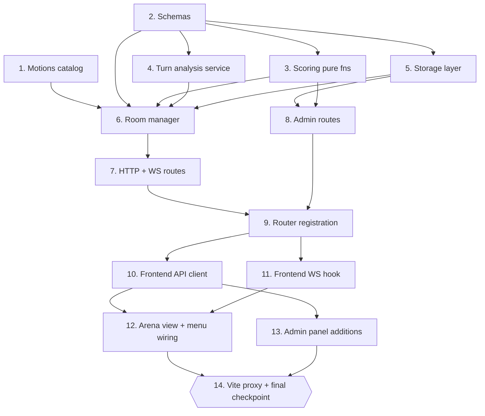

# Implementation Plan: group-debate

## Overview

Convert the `group-debate` design into a sequence of code-generation prompts. Each task is incremental and lands code that compiles + keeps the existing test suite green.

Order intent:

- **Pure data + pure functions first** (Tasks 1–5): motions catalog, Pydantic schemas, scoring math, the inline pipeline reuse (`analyze_turn_audio` + `compute_ai_score`), and the two new JSONL stores. These are testable in isolation without HTTP, WebSocket, or React.
- **Room manager next** (Task 6): the async, in-memory state machine that consumes the pure layer and owns all locking + timers.
- **HTTP + WebSocket surface** (Tasks 7–9): student routes, teacher admin sub-router, and the two-line registration in `app/api/routes.py`.
- **Frontend surface** (Tasks 10–13): TypeScript types + API client, WebSocket hook, arena view + menu/app wiring, admin panel additions.
- **Vite proxy + final integration checkpoint** (Task 14).

Implementation language: **Python 3.11+** for backend (already the codebase standard), **TypeScript + React** for frontend (matching `frontend/src/`). The design uses real code, not pseudocode, so the tasks map directly to file edits.

Test sub-tasks marked with `*` are optional. Property tests reference their design Property number and the requirements clause they validate.

## Tasks

- [x] 1. Motions catalog and static data
  - [x] 1.1 Create `app/data/debate_motions.json`
    - Author the JSON list with at least 8 motion entries. Shape mirrors `app/data/pronunciation_prompts.json`: each entry has `id` (kebab-case), `title` (short label), `text` (motion statement of the form "This house believes …").
    - Suggested motions cover: school uniforms, homework ban, social media age limits, standardized testing, four-day school week, mobile phones in class, mandatory second language, plant-based cafeteria. Do not reuse ids across entries.
    - The file MUST be valid JSON parseable by `json.load` — no trailing commas, no comments.
    - _Requirements: 12.1, 12.3_

  - [x] 1.2 Create `app/debate/__init__.py`
    - Empty package marker file. Establishes the `app.debate` import root used by later tasks.
    - _Requirements: 15.1, 15.2_

- [x] 2. Debate schemas
  - [x] 2.1 Create `app/debate/schemas.py` with internal models
    - Add `ParticipantInternal`, `DebateRoom` per Section 4 of `design.md` (Internal server-only). Use Pydantic v2 (`BaseModel`, `Field`).
    - `ParticipantInternal` fields: `participant_id`, `user_id`, `user_email`, `display_name`, `joined_at`, `is_ready`, `turn_index`, `is_forfeit`, `ws_connected_since`, `disconnected_at`.
    - `DebateRoom` fields: `debate_id`, `code`, `motion_id`, `motion_title`, `motion_text`, `state` (Literal of the 6 room states), `paused`, `participants`, `active_turn_index`, `prep_deadline`, `turn_deadline`, `reconnect_deadline`, `created_at`, `completed_at`, `winner_participant_id`, and the private `_pause_started_at`.
    - _Requirements: 7.1, 15.1_

  - [x] 2.2 Add public projection models
    - Add `ParticipantPublic`, `MotionPublic`, `PublicDebateRoom` per Section 4 (Public / broadcast projection). Ensure `PublicDebateRoom` contains ONLY the fields listed in the design — never `user_email`, `user_id`, `ws_connected_since`, `disconnected_at`, `_pause_started_at`.
    - Add a `to_public(room: DebateRoom) -> PublicDebateRoom` helper in the same module.
    - _Requirements: 11.1, 11.5, 16.4_

  - [x] 2.3 Add persisted models
    - Add `DebateTurn`, `EffectiveScoreEntry`, `DebateRecord`, `Motion` per Section 4 (Persisted). Use `Literal["timeout", "reconnect_timeout"]` for `forfeit_reason` and `conint(ge=0, le=100)` (or `Field(ge=0, le=100)`) for teacher override score.
    - _Requirements: 5.4, 7.3, 9.5, 15.1, 15.2_

  - [x] 2.4 Add request/response and WebSocket envelope models
    - Add `CreateRoomResponse`, `JoinRoomResponse`, `ReadyResponse`, `TurnUploadResponse`, `TeacherReviewRequest`, `DebateWSOutbound`, `DebateWSInbound` per Section 4.
    - `TeacherReviewRequest.score` MUST be a bounded integer 0–100 (use Pydantic constraint); an out-of-range value must raise pydantic validation error so the route can translate it to `invalid_score`.
    - _Requirements: 10.3, 10.6, 11.2_

  - [x] 2.5 Write property test for `PublicDebateRoom` field visibility
    - Add `tests/test_debate_schemas.py`. Randomized test (N=100) that generates random `DebateRoom` instances (with non-empty email, uid, timestamps) and asserts `to_public(room).model_dump_json()` string does not contain the substrings `user_email`, `user_id`, `ws_connected_since`, `disconnected_at`, or `_pause_started_at`.
    - **Property 10: PublicDebateRoom hides internal fields**
    - **Validates: Requirements 11.1, 11.5**

- [ ] 3. Debate scoring pure functions
  - [x] 3.1 Create `app/debate/scoring.py`
    - Implement `compute_effective_score(turn: DebateTurn) -> float` per Section "Winner Selection" of `design.md`. Returns `float(turn.teacher_override_score)` when present, else `float(turn.ai_score)`.
    - Implement `compute_winner(turns, participants) -> Optional[str]` per the same section. Sort key: `(-effective_score, submitted_at ASC, turn_index ASC, participant_id)`. Return `None` when no eligible turns.
    - _Requirements: 9.2, 9.3, 9.4, 10.4_

  - [ ] 3.2 Write property test for effective score priority
    - In `tests/test_debate_scoring.py`, randomized test (N=100) that generates `DebateTurn` instances with random `ai_score` in `[0, 100]` and `teacher_override_score` drawn from `{None, random int in [0, 100]}`. Assert `compute_effective_score(turn)` equals `float(teacher_override_score)` when present, `float(ai_score)` otherwise.
    - **Property 4: Effective_Score priority**
    - **Validates: Requirements 10.3, 10.4**

  - [ ] 3.3 Write property test for winner determinism and cascade
    - In `tests/test_debate_scoring.py`, randomized test (N=100) that generates a random participant list (size 4–6) and one turn per participant with random `ai_score`, `teacher_override_score`, `submitted_at`, and `turn_index`. Assert (a) two calls with equal inputs return equal ids, (b) the returned participant's effective score `>=` every other's, (c) tiebreakers unfold as documented (verify by re-sorting a mirror of the tuple key).
    - **Property 5: Winner determinism and tiebreaker cascade**
    - **Validates: Requirements 9.2, 9.3, 9.4**

  - [ ] 3.4 Write property test for forfeit turn shape
    - In `tests/test_debate_scoring.py`, randomized test (N=100) that generates `DebateTurn` instances with `forfeit_reason` drawn from `{"timeout", "reconnect_timeout"}`. Assert every such turn satisfies `ai_score == 0.0` AND `scoring_unavailable is False` (this is an invariant the room manager must uphold; the property doubles as a contract check).
    - **Property 6: Forfeit turn has ai_score 0**
    - **Validates: Requirements 5.6, 8.3**

- [ ] 4. Debate turn analysis service (inline `/analyze` reuse)
  - [x] 4.1 Create `app/debate/service.py` with `analyze_turn_audio`
    - Implement `async def analyze_turn_audio(file, user)` exactly as the code block under `app/debate/service.py` in `design.md`. It must call the pipeline in this exact order: `save_uploaded_audio` → `preprocess_audio_asset` → `transcribe_audio` → `assess_pronunciation(expected_text=None, ...)` → `build_fluency_section`.
    - Emit one `stage_log(...)` info line per stage using `app.core.logging_helpers.stage_log`. Include `analysis_id` on every line.
    - Construct an `AnalyzeResponse` with `communication` and `debug` filled per the design snippet, and call `save_attempt(build_attempt_summary(...))` inside a `try/except` that logs at WARNING on failure.
    - Return the 5-tuple `(audio_asset, transcription, pronunciation, fluency, analysis_id)`.
    - The function MUST NOT edit or import from any module outside `app.core`, `app.audio`, `app.asr`, `app.pronunciation`, `app.fluency`, `app.attempts`, `app.schemas`, `app.auth`.
    - _Requirements: 5.3, 16.1, 16.4_

  - [x] 4.2 Implement `compute_ai_score` in `app/debate/service.py`
    - Implement `compute_ai_score(pronunciation, fluency) -> tuple[float, bool]` per Section "AI Score Computation".
    - Return `((pron + clarity) / 2, False)` when both available; `(clarity, False)` when only clarity; `(0.0, True)` otherwise. Clamp every branch to `[0, 100]` and round to 2 decimals.
    - Treat `pronunciation is None` or `pronunciation.available is False` as pron-unavailable.
    - _Requirements: 6.1, 6.2, 6.3, 6.4_

  - [ ] 4.3 Write unit test for `analyze_turn_audio` stage order
    - Add `tests/test_debate_service.py`. Patch each of the five stage functions with `MagicMock` returning deterministic stubs and call `await analyze_turn_audio(mock_upload_file, mock_user)`. Assert (a) each stage function was called exactly once, (b) `save_uploaded_audio` called before `preprocess_audio_asset`, `preprocess_audio_asset` before `transcribe_audio`, `transcribe_audio` before `assess_pronunciation`, `assess_pronunciation` before `build_fluency_section` — verify via `mock_calls` ordering, (c) `assess_pronunciation` was invoked with `expected_text=None`.
    - _Requirements: 5.3, 16.4_

  - [ ] 4.4 Write property test for `compute_ai_score` clamping and fallback
    - In `tests/test_debate_service.py`, randomized test (N=100) that generates random `PronunciationResult` (available True/False, `overall_score` in `[-50, 150]` including `None`) and random `FluencyResult` with `clarity_score` in `[-50, 150]` including `None`. Assert (a) return `[0, 100]` always, (b) when both present and available → `(round((p+c)/2, 2), False)` clamped, (c) when only clarity → `(round(c, 2), False)` clamped, (d) when neither → `(0.0, True)`.
    - **Property 3: AI_Score in [0, 100]**
    - **Validates: Requirements 6.4**

- [ ] 5. Debate storage layer
  - [x] 5.1 Create `app/storage/debates.py`
    - Bind `_PATH = Path("outputs/debates.jsonl")`. Implement `save_debate(record: DebateRecord)`, `load_debate(debate_id) -> Optional[DebateRecord]`, `list_debates_for_user(user_id) -> list[DebateRecord]`, `list_pending_review_debates() -> list[DebateRecord]`, `update_winner(debate_id, winner_id) -> None`.
    - Use `app.storage._jsonl.append_jsonl`, `read_jsonl`, and `overwrite_jsonl` primitives — do NOT open the file directly.
    - `list_pending_review_debates` filters to records in state `complete` that have at least one turn missing `teacher_override_score` (join against `debate_turns` store — pass or import as needed).
    - _Requirements: 7.3, 10.1, 13.1, 13.3, 15.1_

  - [x] 5.2 Create `app/storage/debate_turns.py`
    - Bind `_PATH = Path("outputs/debate_turns.jsonl")`. Implement `save_turn(turn: DebateTurn)`, `load_turn(turn_id) -> Optional[DebateTurn]`, `list_turns_for_debate(debate_id) -> list[DebateTurn]`, `apply_teacher_review(turn_id, score, comment) -> Optional[DebateTurn]`.
    - `apply_teacher_review` MUST use `overwrite_jsonl` to rewrite the file in place with the target row updated; return the updated `DebateTurn` or `None` if the id is unknown.
    - _Requirements: 5.4, 10.3, 15.2_

  - [ ] 5.3 Write property test for turn round-trip
    - Add `tests/test_debate_storage.py`. Randomized test (N=100) that generates a random list of `DebateTurn` and, using `monkeypatch` to point `_PATH` at `tmp_path`, appends each via `save_turn` and asserts every id round-trips through `load_turn` to an equivalent record.
    - _Requirements: 15.2_

  - [ ] 5.4 Write property test for debate record round-trip
    - In `tests/test_debate_storage.py`, randomized test (N=100) for `save_debate` / `load_debate` and `list_debates_for_user` filtering. Assert (a) round-trip equality on JSON dump, (b) `list_debates_for_user` returns exactly the records whose `participants[*].user_id` includes the queried user.
    - _Requirements: 13.1, 15.1_

  - [ ] 5.5 Write property test for teacher review overwrite
    - In `tests/test_debate_storage.py`, randomized test (N=100) that generates N turns, saves them, picks one at random, calls `apply_teacher_review(turn_id, score, comment)` with random score in `[0, 100]` and random comment, then reloads and asserts (a) the target row now has the new score + comment, (b) every other row is unchanged.
    - _Requirements: 10.3_

- [ ] 6. Debate room manager
  - [x] 6.1 Create `app/debate/room_manager.py` skeleton and constants
    - Bind `ROOM_CODE_ALPHABET`, `ROOM_CODE_LENGTH`, `PREP_SECONDS`, `TURN_SECONDS`, `TURN_GRACE_SECONDS`, `RECONNECT_GRACE_SECONDS`, `MIN_PARTICIPANTS`, `MAX_PARTICIPANTS`, `GC_TTL_SECONDS` at the module level per the design.
    - Define `class DebateRoomManager` with `__init__(self)` that seeds `self._rooms: dict[str, DebateRoom]`, `self._sockets: dict[str, dict[str, WebSocket]]`, `self._locks: dict[str, asyncio.Lock]`, `self._timers: dict[str, asyncio.Task]`.
    - Implement `_lock_for(code) -> asyncio.Lock`, `_random_code() -> str` (uses `secrets.choice`), `_load_motions() -> list[Motion]` (reads `app/data/debate_motions.json`, raises `motions_unavailable` on parse failure), `_pick_random_motion() -> Motion`, `get_state(code)`, `to_public(room)`.
    - _Requirements: 1.1, 1.2, 12.1, 12.4, 15.3_

  - [x] 6.2 Implement room creation and join
    - `create_room(user)`: generate a non-colliding 6-char code (retry on collision), select a random motion, register the caller as the first participant with `turn_index=0` and `is_ready=False`, return the `DebateRoom`.
    - `join_room(code, user)`: reject with `HTTPException(404, "room_not_found")`, `409 "room_not_joinable"`, `409 "room_full"` per Section "Error Handling"; idempotent for re-joins by the same `user_id`; broadcast on successful add.
    - Both methods take `self._lock_for(code)` before mutating state.
    - _Requirements: 1.1, 1.2, 1.3, 1.4, 1.5, 2.1, 2.2, 2.3, 2.4, 2.5, 2.6_

  - [x] 6.3 Implement ready flip, auto-start, prep phase
    - `flip_ready(code, user)`: reject with `403 "not_a_participant"` if caller not in the room, toggle the caller's `is_ready`, broadcast.
    - After every ready flip, if the room is in `waiting`, `all(p.is_ready for p in participants)`, and `len(participants) >= MIN_PARTICIPANTS`, transition to `prep`: set `prep_deadline = time.time() + PREP_SECONDS`, assign stable `turn_index` in join order starting at 0, spawn a prep timer task that transitions to `speaking` on elapse.
    - On entering `speaking`, set `active_turn_index=0` and `turn_deadline = time.time() + TURN_SECONDS + TURN_GRACE_SECONDS`; spawn a turn timer that calls `advance_or_forfeit(code, reason="timeout")` on elapse.
    - _Requirements: 3.1, 3.2, 3.3, 3.4, 3.5, 4.1, 4.2, 4.4_

  - [x] 6.4 Implement turn submission and state advance
    - `submit_turn(code, user, audio_asset, transcription, pronunciation, fluency, analysis_id)` acquires the room lock, re-validates state (`speaking`, `not paused`, caller's `turn_index == active_turn_index`), computes `(ai_score, scoring_unavailable) = compute_ai_score(pronunciation, fluency)`, builds a `DebateTurn`, calls `debate_turns.save_turn(turn)`, then either increments `active_turn_index` + resets `turn_deadline`, or transitions to `scoring` if it was the last participant.
    - When entering `scoring`, wait for outstanding analyses (in this design they are already synchronous, so scoring transitions immediately to `complete`).
    - On transition to `complete`, load all turns for the debate, compute the winner via `debate.scoring.compute_winner`, build a `DebateRecord` with `effective_scores` list, persist via `debates.save_debate`, and set `winner_participant_id` on the room.
    - Race between pre-check and lock re-check MUST raise `ValueError("not_your_turn")` / `ValueError("debate_paused")` for the route to translate into 409.
    - _Requirements: 5.1, 5.2, 5.3, 5.4, 5.5, 6.4, 7.1, 7.2, 7.3, 9.1, 9.2, 9.5_

  - [x] 6.5 Implement WebSocket attach/detach and pause overlay
    - `attach_socket(code, participant_id, ws)` and `detach_socket(code, participant_id, ws)` register/unregister sockets in `self._sockets[code]`.
    - `handle_disconnect(code, participant_id)`: if room state ∈ `{prep, speaking, scoring}`, set `paused = True`, `reconnect_deadline = time.time() + RECONNECT_GRACE_SECONDS`, capture `_pause_started_at = time.time()`, pause the turn timer (cancel + remember remaining budget), broadcast.
    - `handle_reconnect(code, participant_id)`: clear `paused`, clear `reconnect_deadline`, extend `turn_deadline` by `time.time() - _pause_started_at`, respawn turn timer with remaining budget, broadcast.
    - `advance_or_forfeit(code, reason)` handles both `"timeout"` (persist a forfeit `DebateTurn` for the current speaker with `ai_score=0`, `scoring_unavailable=False`, `forfeit_reason="timeout"`, `submitted_at=time.time()`) and `"reconnect_timeout"` (mark the disconnected participant `is_forfeit=True`; if they were the active speaker, persist a forfeit turn with `forfeit_reason="reconnect_timeout"`). Advance `active_turn_index` (or transition to `scoring` if last), broadcast.
    - When connected non-forfeit count drops below 2, transition the room to `abandoned` and do NOT persist a `DebateRecord` (Req 7.4, 7.5, 8.6).
    - _Requirements: 5.6, 7.4, 7.5, 8.1, 8.2, 8.3, 8.4, 8.5, 8.6_

  - [x] 6.6 Implement broadcast helper
    - `broadcast(code)`: build `PublicDebateRoom` via `to_public`, send `{"type": "state", "state": public}` to every open socket for the room. Best-effort delivery — ignore per-socket send exceptions and log at WARNING.
    - _Requirements: 2.5, 11.2, 11.5_

  - [ ] 6.7 Write unit test for room code alphabet and length
    - Add `tests/test_debate_room_manager.py`. Randomized test (N=100) that calls `_random_code()` and asserts `len(code) == 6` and every character is in `ROOM_CODE_ALPHABET` (excludes `0`, `O`, `1`, `I`, `L`).
    - **Property 1: Room code shape**
    - **Validates: Requirements 1.1**

  - [ ] 6.8 Write unit test for room capacity cap
    - In `tests/test_debate_room_manager.py`, example-based test: create a room, add 6 distinct users via `join_room`, then attempt a 7th join and assert `HTTPException(status_code=409, detail="room_full")` is raised and the participant list length stays at 6.
    - **Property 7: Room capacity cap**
    - **Validates: Requirements 2.3**

  - [ ] 6.9 Write unit test for auto-start threshold
    - In `tests/test_debate_room_manager.py`, randomized test (N=100) that joins `n` participants (n in `{2, 3, 4, 5, 6}`) and flips a random subset ready. Assert `room.state == "prep"` iff every participant is ready AND `n >= 4`; otherwise `room.state == "waiting"`.
    - **Property 8: Auto-start threshold**
    - **Validates: Requirements 3.2, 3.5**

  - [ ] 6.10 Write unit test for deadline durations
    - In `tests/test_debate_room_manager.py`, example-based tests using `freezegun` or a monkeypatched `time.time`: (a) drive a room into `prep` and assert `prep_deadline - trigger_time ∈ [59.5, 60.5]`; (b) drive it into `speaking` and assert `turn_deadline - trigger_time ∈ [134.5, 135.5]`; (c) trigger a WS disconnect during `speaking` and assert `reconnect_deadline - trigger_time ∈ [29.5, 30.5]`.
    - **Property 9: Deadline durations**
    - **Validates: Requirements 4.1, 4.2, 5.6, 8.1**

  - [ ] 6.11 Write unit test for forfeit-on-timeout and state transitions
    - In `tests/test_debate_room_manager.py`, drive a synthetic 4-participant room through the full state sequence `waiting → prep → speaking → speaking → speaking → speaking → scoring → complete`. Record every observed `room.state` value; assert every consecutive pair appears in the transition table (Section 3 of `design.md`). Separately, simulate the active speaker missing the 135s window and assert the emitted `DebateTurn` has `forfeit_reason == "timeout"`, `ai_score == 0.0`, `scoring_unavailable == False`.
    - **Property 2: State transitions follow the documented edges**
    - **Validates: Requirements 7.1, 7.5**

- [ ] 7. Debate HTTP + WebSocket routes
  - [x] 7.1 Create `app/debate/routes.py` with the HTTP endpoints
    - Author a `router = APIRouter(prefix="/debate", tags=["debate"])` and implement `create_room`, `join_room`, `flip_ready`, `get_room`, `list_motions`, `my_debates` per the endpoint table in Section "app/debate/routes.py" of `design.md`. Every handler except the WS one takes `current_user: User = Depends(require_user)`.
    - `create_room`, `join_room`, `flip_ready` delegate to `room_manager` and return the shape from the corresponding response model. `get_room` returns `to_public(room)` or 404. `list_motions` returns the loaded motions list. `my_debates` calls `debates.list_debates_for_user(current_user.uid)`, sorts by `completed_at` descending, projects to the `MyDebateEntry` shape.
    - _Requirements: 1.1, 1.3, 1.4, 1.5, 2.1, 2.5, 3.1, 3.4, 11.1, 12.2, 13.1, 13.2, 13.3, 13.4_

  - [x] 7.2 Implement `POST /debate/rooms/{code}/turn`
    - Author the `upload_turn` handler exactly as the pseudocode block in Section "Full pseudocode for `POST /debate/rooms/{code}/turn`": normalize code → early-reject on `room_not_found` / `debate_paused` / `not_in_speaking_state` / `not_a_participant` / `not_your_turn` → call `analyze_turn_audio(file, current_user)` without holding the room lock → call `room_manager.submit_turn(...)` → broadcast → return `TurnUploadResponse`.
    - Catch pipeline exceptions and raise `HTTPException(502, "analysis_failed")`. Catch `ValueError` from `submit_turn` and translate to 409 with the value as detail.
    - _Requirements: 5.1, 5.2, 5.3, 5.4, 5.5, 6.1, 6.2, 6.3, 6.4, 16.4_

  - [x] 7.3 Implement `WS /debate/ws/{code}`
    - Author `debate_websocket(websocket, code)`. Read `id_token` from query string; call `verify_token_string(id_token)` — on failure `await websocket.close(code=4401)` and return; on `room_manager.get_state(code) is None` `await websocket.close(code=4404)` and return.
    - Locate the participant by `user.uid`. If not a participant, close with 4403 (design does not specify but avoid silent success; use the same close pattern as `battles`).
    - On success `await websocket.accept()`, immediately send the current `to_public(room)` as `{"type":"state","state":...}`, register via `room_manager.attach_socket`, then loop `await websocket.receive_text()` accepting only `{"type":"ping"}` inbound. On `WebSocketDisconnect` call `room_manager.handle_disconnect(code, participant_id)`.
    - _Requirements: 11.2, 11.3, 11.4, 11.5_

  - [ ] 7.4 Write integration test for the WS close-code contract
    - Add `tests/test_debate_routes.py`. Using `TestClient.websocket_connect("/debate/ws/UNKNOWN", params={"id_token": VALID_TOKEN})` assert the connection closes with code `4404`. Using an invalid token against a real room assert the connection closes with code `4401` and never receives an accepted state message. Repeat both for N=50 randomized token/room combinations.
    - **Property 12: WebSocket close code mapping**
    - **Validates: Requirements 11.3, 11.4**

  - [ ] 7.5 Write integration test for the full HTTP round-trip
    - In `tests/test_debate_routes.py`, monkey-patch `analyze_turn_audio` to return a synthetic 5-tuple. Drive four fake users through create → join → ready → auto-start → prep-timer-tick → speaking → four turn uploads → complete. Assert every intermediate `GET /debate/rooms/{code}` returns the expected state and the final response includes a non-null `winner_participant_id`.
    - _Requirements: 5.1, 5.3, 7.1, 7.3, 11.1_

  - [ ] 7.6 Write integration test for room_full and race errors
    - In `tests/test_debate_routes.py`, example-based tests: (a) join 7 users to one room and assert the 7th call returns 409 with `detail=="room_full"`; (b) upload a turn while `paused=True` and assert 409 with `detail=="debate_paused"`; (c) upload a turn as a non-active-speaker and assert 409 with `detail=="not_your_turn"`.
    - _Requirements: 2.3, 5.2, 8.4_

- [ ] 8. Debate admin routes
  - [x] 8.1 Create `app/debate/admin_routes.py`
    - Author `router = APIRouter(prefix="/admin/debates", tags=["admin", "debate"])`. Implement `list_debates`, `get_debate`, `review_turn` per Section "Admin sub-router — `app/debate/admin_routes.py`" of `design.md`. Every handler takes `current_user: User = Depends(require_teacher)`.
    - `list_debates` supports `status=pending_review` filter via `debates.list_pending_review_debates()`. `get_debate` returns the debate record joined with its turns. `review_turn` validates `body.score ∈ [0, 100]` (Pydantic does this) and delegates to `debate_turns.apply_teacher_review`.
    - _Requirements: 10.1, 10.2, 10.3, 10.5, 10.6_

  - [x] 8.2 Implement winner recompute on override
    - Inside `review_turn`, after `apply_teacher_review` succeeds, load all turns for the debate, load the debate record, call `debate.scoring.compute_winner(turns, participants)`, and if the returned id differs from the persisted `winner_participant_id` call `debates.update_winner(debate_id, new_winner_id)`.
    - Return the updated `DebateTurn` as the response body.
    - _Requirements: 10.4_

  - [ ] 8.3 Write integration test for teacher override + winner recompute
    - In `tests/test_debate_admin_routes.py`, seed a debate with 4 completed turns where participant A has the highest `ai_score`. As a teacher, POST a review that gives participant B a `teacher_override_score` strictly greater than A's `ai_score`. Assert (a) the returned turn has the new score/comment, (b) `debates.load_debate(debate_id).winner_participant_id == B.participant_id`.
    - _Requirements: 10.3, 10.4_

  - [ ] 8.4 Write integration test for auth guard
    - In `tests/test_debate_admin_routes.py`, hit each of `GET /admin/debates`, `GET /admin/debates/{id}`, `POST /admin/debates/{id}/turns/{tid}/review` as a non-teacher user and assert the `require_teacher` failure response (403 or the same status the existing admin routes return).
    - _Requirements: 10.5_

  - [ ] 8.5 Write integration test for invalid score
    - In `tests/test_debate_admin_routes.py`, randomized test (N=50) that POSTs a `score` drawn from `{-1, 101, 200, -100, "abc", None, 3.5}` and asserts a 422 response with `detail` referencing `invalid_score` (or Pydantic's validation error shape). Also test the happy path with `score=75`.
    - _Requirements: 10.6_

- [x] 9. Router registration in `app/api/routes.py`
  - [x] 9.1 Add the two `include_router` calls
    - Add the imports `from app.debate.routes import router as debate_router` and `from app.debate.admin_routes import router as debate_admin_router` at the top of `app/api/routes.py`.
    - Add `router.include_router(debate_router)` and `router.include_router(debate_admin_router)` alongside the existing `include_router` block. No other lines in the file may change.
    - Verify with `python -c "import app.main; print('OK')"` that the app imports cleanly and that `app.include_router` picks up the new endpoints under `/debate` and `/admin/debates`.
    - _Requirements: 14.6, 16.2_

- [ ] 10. Frontend types and API client
  - [x] 10.1 Create `frontend/src/debateApi.ts`
    - Author the TypeScript interfaces and functions listed under Section "`frontend/src/debateApi.ts`" of `design.md`: `DebateState`, `MotionPublic`, `ParticipantPublic`, `PublicDebateRoom`, `CreateRoomResponse`, `JoinRoomResponse`, `TurnUploadResponse`, `MyDebateEntry`.
    - Implement `createDebateRoom`, `joinDebateRoom`, `flipReady`, `uploadTurn`, `fetchDebateRoom`, `fetchMotions`, `fetchMyDebates`. Mirror `battleApi.ts` for the fetch wrapper, error unwrap, and auth-header helper.
    - `uploadTurn(code, audio)` posts a multipart form (`FormData` with `file` field) to `/debate/rooms/{code}/turn`.
    - _Requirements: 14.2_

  - [ ] 10.2 Write TypeScript sanity via `npx tsc --noEmit`
    - Add a small `frontend/src/debateApi.spec.ts` file (or reuse an existing test harness if one exists) that imports every exported symbol from `debateApi.ts` and asserts the type shape via `satisfies` clauses. Manual verification: `npx tsc --noEmit` from `frontend/` completes with zero errors.
    - _Requirements: 14.2_

- [ ] 11. Frontend WebSocket hook
  - [x] 11.1 Create `frontend/src/hooks/useDebateSocket.ts`
    - Implement `useDebateSocket(code, participantId): UseDebateSocket` per Section "`frontend/src/hooks/useDebateSocket.ts`" of `design.md`. Mirror `useBattleSocket.ts` for reconnect delay ladder `[1000, 2000, 4000, 8000]`, keepalive ping, and close-code handling.
    - Build the URL as `ws(s)://<host>/debate/ws/<CODE>?participant_id=...&id_token=...`. On close `4401` surface an auth error string and stop retrying. On `4404` surface `"room_not_found"` and stop retrying. On any other close, schedule reconnect.
    - Client MUST send only `{"type":"ping"}` outbound. Inbound `{"type":"state","state":...}` messages update the `state` field.
    - _Requirements: 14.3_

  - [ ] 11.2 Write hook-level sanity test
    - Add `frontend/src/hooks/useDebateSocket.test.ts` using `@testing-library/react` (if already installed) or a lightweight mock harness. Assert that (a) the hook opens a WS to the expected URL, (b) an incoming `state` message updates the returned `state` field, (c) `4401` close prevents further reconnect attempts.
    - _Requirements: 14.3_

- [ ] 12. Frontend arena view + menu/app wiring
  - [x] 12.1 Create `frontend/src/components/DebateArenaView.tsx`
    - Implement the sub-screen router per the "State → sub-screen mapping" table in Section "`frontend/src/components/DebateArenaView.tsx`" of `design.md`. Screens: Lobby, WaitingReady, Prep, Speaking, WaitingForOthers, Scoring, Results, PausedOverlay, Abandoned.
    - Speaking sub-screen uses the existing `useAudioRecorder` hook (unchanged) and calls `uploadTurn(code, blob)` when `active_turn_index === myTurnIndex`. Auto-stop recording on `now >= turn_deadline`.
    - Results sub-screen renders per-participant `effective_score` and highlights `winner_participant_id`.
    - Accept a single prop `onBack: () => void` to route back to the main menu.
    - _Requirements: 14.1, 14.4_

  - [x] 12.2 Additive change to `frontend/src/components/MainMenuView.tsx`
    - Add a new "Group Debate" entry to the existing features array per the design snippet (icon `MessageSquareText` from `lucide-react`, `status: "live"`, violet/fuchsia gradient). Add a new prop `onSelectDebate: () => void` to `MainMenuViewProps` and use it in the entry's `onClick`.
    - Do NOT restructure existing entries or change the existing prop names.
    - _Requirements: 14.1, 16.3_

  - [x] 12.3 Additive change to `frontend/src/App.tsx`
    - Add `"debate-arena"` to the `View` union. Add `const handleSelectDebate = useCallback(() => setView("debate-arena"), [])`. Add a render branch `view === "debate-arena" && <DebateArenaView onBack={handleBackToMenu} />`. Pass `onSelectDebate={handleSelectDebate}` to `<MainMenuView />`.
    - No other view branches or state fields change.
    - _Requirements: 14.1, 16.3_

  - [ ] 12.4 Manual smoke check for the arena view
    - Not automated: run the dev server (backend + `npm run dev`), open 4 tabs, join by code, ready up, verify the prep countdown, each turn's timer, and the final results screen render as expected.
    - _Requirements: 14.1, 14.4_

- [ ] 13. Frontend admin panel additions
  - [x] 13.1 Additive change to `frontend/src/components/AdminPanelView.tsx`
    - Add `"debates"` to the `AdminTab` union. Add `{ id: "debates", label: "Pending Debates", icon: MessagesSquare }` to the existing `TABS` array. Add a render branch for `active === "debates"`. Add optional prop `onOpenDebate?: (id: string) => void`.
    - Existing tabs, TABS entries, and props remain unchanged.
    - _Requirements: 14.5, 16.3_

  - [x] 13.2 Create `frontend/src/components/admin/debates/PendingDebatesList.tsx`
    - Fetch `/admin/debates?status=pending_review`, render a table with columns `code | motion | completed_at | pending turns | action`. Row "action" button invokes `onOpenDebate(debateId)`.
    - Loading + empty + error states mirror the existing pending-interviews component.
    - _Requirements: 14.5_

  - [x] 13.3 Create `frontend/src/components/admin/debates/DebateReviewPanel.tsx`
    - Given a `debateId`, fetch `/admin/debates/{debate_id}`. For each turn render `ai_score`, an integer input for override `[0..100]`, a comment textarea, and a submit button that POSTs `/admin/debates/{debate_id}/turns/{turn_id}/review`.
    - On successful submit, refresh the panel and, if the response indicates a winner change, surface a small "Winner updated" toast.
    - _Requirements: 10.3, 10.4, 14.5_

  - [ ] 13.4 Type-check the new admin components
    - Not a separate file: after 13.1–13.3, run `npx tsc --noEmit` from `frontend/` and assert zero errors across the new files and the additive edits.
    - _Requirements: 14.5_

- [x] 14. Vite proxy and final checkpoint
  - [x] 14.1 Additive change to `frontend/vite.config.ts`
    - Add one entry to `server.proxy`:
      ```ts
      "/debate": { target: "http://localhost:8080", changeOrigin: true, ws: true },
      ```
    - Do not restructure or reorder existing proxy entries.
    - _Requirements: 14.6_

  - [x] 14.2 Final backend integration checkpoint
    - Run `python -c "import app.main; print('OK')"` from the repo root and assert exit code 0.
    - Run `python -m pytest -q` and assert all tests pass. If optional starred tests were implemented in earlier tasks, they must pass too.
    - _Requirements: 15.3, 16.1_

  - [x] 14.3 Final frontend type-check
    - Run `npx tsc --noEmit` from `frontend/` and assert zero errors. Confirm that the new files (`debateApi.ts`, `useDebateSocket.ts`, `DebateArenaView.tsx`, `admin/debates/*.tsx`) and the additive edits (`MainMenuView.tsx`, `App.tsx`, `AdminPanelView.tsx`, `vite.config.ts`) all type-check.
    - _Requirements: 14.1, 14.2, 14.3, 14.5, 14.6_

  - [x] 14.4 Final integration checkpoint
    - Ensure all tests pass, ask the user if questions arise. Manually verify the `/debate` proxy works in dev (`vite`), a 4-user room reaches `complete` end-to-end, and the admin "Pending Debates" tab opens a real debate's review panel.
    - _Requirements: 14.1, 14.4, 14.5, 14.6_

## Notes

- Sub-tasks marked with `*` are optional. Core implementation sub-tasks are never marked optional.
- Every task references the requirements clauses it satisfies for traceability. Property test sub-tasks additionally cite the design Property number and its validated requirements clause.
- The plan preserves the two invariants that made the design tractable: (a) `/analyze` pipeline reuse is inline (not by editing `app/api/analysis_routes.py`), and (b) the admin sub-router lives under `app/debate/`, not `app/admin/`.
- Task ordering keeps the tree green at every checkpoint: pure data + pure functions (Tasks 1–5) → room manager (Task 6) → HTTP + WS surface (Tasks 7–9) → frontend (Tasks 10–13) → proxy + final integration (Task 14).
- Every write is either a new file under `app/debate/`, `app/storage/`, `app/data/`, `frontend/src/`, or an additive edit to one of the five allow-listed files (`app/api/routes.py`, `frontend/src/components/MainMenuView.tsx`, `frontend/src/App.tsx`, `frontend/src/components/AdminPanelView.tsx`, `frontend/vite.config.ts`). No file listed in Requirement 16.1 is edited.

## Task Dependency Graph



**Critical path**: 2 → 6 → 7 → 9 → 10 → 12 → 14. Tasks 1, 3, 4, 5, 8, 11, 13 hang off this spine and can be developed in parallel with their predecessors satisfied.

**Stage gates**:

- Task 6 (room manager) gates the whole HTTP + WS surface. Its state-machine tests (6.7–6.11) must be green before Task 7 starts.
- Task 9 (router registration) gates the frontend. `python -c "import app.main"` must succeed before any frontend task begins integration.
- Task 14 (final checkpoint) gates the spec being marked complete. Every core sub-task in Tasks 1–13 must be implemented and every non-starred test must pass here.

**Parallelizable groups**:

- Tasks 1 and 2 are independent — data file and schemas.
- Within Wave 2, Tasks 3, 4, 5 touch disjoint files (`scoring.py`, `service.py`, `storage/*.py`) and can be done in any order.
- Within Wave 6, Tasks 10 and 11 are independent frontend modules.
- Within Wave 7, Task 13 (admin panel) is independent of Task 12 (arena view) — different components, different routes.

```json
{
  "waves": [
    {
      "name": "Foundation",
      "tasks": ["1", "2"]
    },
    {
      "name": "Pure Layer",
      "tasks": ["3", "4", "5"],
      "dependsOn": ["Foundation"]
    },
    {
      "name": "Room Manager",
      "tasks": ["6"],
      "dependsOn": ["Pure Layer"]
    },
    {
      "name": "Routes",
      "tasks": ["7", "8"],
      "dependsOn": ["Room Manager"]
    },
    {
      "name": "Registration",
      "tasks": ["9"],
      "dependsOn": ["Routes"]
    },
    {
      "name": "Frontend Contracts",
      "tasks": ["10", "11"],
      "dependsOn": ["Registration"]
    },
    {
      "name": "Frontend Views",
      "tasks": ["12", "13"],
      "dependsOn": ["Frontend Contracts"]
    },
    {
      "name": "Final Checkpoint",
      "tasks": ["14"],
      "dependsOn": ["Frontend Views"]
    }
  ]
}
```
