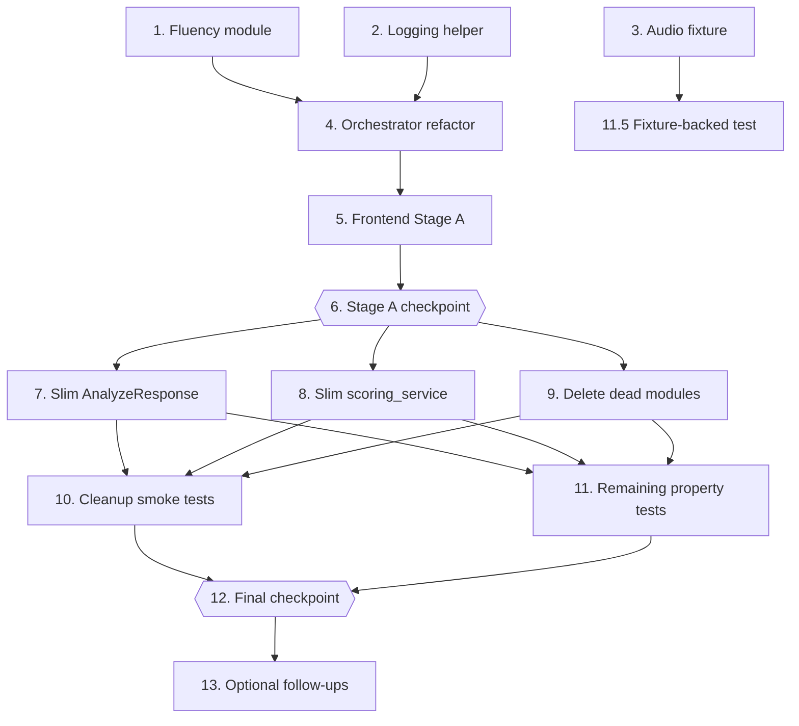

# Implementation Plan: phase-0-1-cleanup-foundation

## Overview

Convert the design into a sequence of code-generation prompts. Each task is incremental: it produces code that compiles, passes the existing tests, and integrates with what came before. The plan follows the two-stage transition described in `design.md` so the app stays working at every checkpoint.

**Stage A** (Tasks 1–6): add the new fluency module, logging helper, audio fixture, and orchestrator changes. Keep the legacy `AnalyzeResponse` fields for one stage so the frontend can switch over without a flicker.

**Stage B** (Tasks 7–10): trim the legacy fields, slim the schemas, delete the dead modules, and finalize the cleanup.

**Stage C** (Tasks 11–13): final tests, smoke checks, manual verification, and the final checkpoint.

Test-related sub-tasks are marked optional with `*`. Core implementation sub-tasks are not.

Implementation language: **Python 3.11+** (already in use across the codebase). The design does not use pseudocode for any module; the code samples in `design.md` are real Python that maps directly to file edits.

## Tasks

- [x] 1. Add Fluency_Service module and contract
  - [x] 1.1 Create `app/fluency/__init__.py`, `app/fluency/schemas.py`, and `app/fluency/service.py`
    - In `schemas.py` define `FluencyResult` with the eight fields from the Data Models section: `words_per_minute`, `speech_duration_seconds`, `total_duration_seconds`, `silence_ratio`, `long_pause_count`, `filler_word_count`, `repetition_count`, `clarity_score`.
    - In `service.py` implement `build_fluency_section(transcription, audio_asset) -> FluencyResult` per the pseudocode in `design.md`. Import `calculate_clarity_score` from `app.pronunciation.scoring_service`.
    - _Requirements: 7.1, 7.2, 7.3, 7.4, 7.6_

  - [ ]* 1.2 Write property test for fluency contract shape
    - Add `tests/test_fluency_service.py` with one randomized test (N=100) that builds a `FluencyResult` from random `(transcription, audio_asset)` pairs and asserts the JSON dump has exactly the eight expected keys.
    - **Property 12: FluencyResult contract shape**
    - **Validates: Requirements 7.1**

  - [ ]* 1.3 Write property test for the WPM formula
    - In the same file, add a randomized test (N=100) that generates a random list of `TranscribedWord` with `start <= end` and asserts `words_per_minute` equals `round(len(words) / ((max_end - min_start) / 60.0), 2)`. Include the empty-list case in the generator.
    - **Property 13: WPM formula**
    - **Validates: Requirements 7.2, 7.3**

  - [ ]* 1.4 Write property test for total_duration pass-through
    - Add a randomized test (N=100) that varies `audio_asset.duration_seconds` across `None`, `0`, and random positive floats and asserts the FluencyResult forwards the value (with `None` mapping to `0`).
    - **Property 14: total_duration_seconds passes through audio duration**
    - **Validates: Requirements 7.4**

  - [ ]* 1.5 Write property test for clarity_score formula
    - Add a randomized test (N=100) that generates `TranscribedWord` lists with random confidences in `[0, 1]` and asserts `calculate_clarity_score` equals `round(mean(confidences) * 100, 2)`. Include the empty-list edge case.
    - **Property 15: clarity_score formula**
    - **Validates: Requirements 7.6**

- [x] 2. Add structured logging helper
  - [x] 2.1 Create `app/core/logging_helpers.py`
    - Define `stage_log(stage: str, analysis_id: str, **fields) -> str` that returns `"stage=<s> analysis_id=<id> k=v ..."` per the design.
    - Re-export `logger` from `app.core.logger` (optional convenience).
    - _Requirements: 11.1, 11.2, 11.3, 11.4, 11.5, 11.6_

  - [ ]* 2.2 Write unit test for `stage_log`
    - Add `tests/test_logging_helpers.py` with example-based tests covering empty `fields`, single key, multiple keys, and special characters in values.
    - _Requirements: 11.1, 11.2, 11.3, 11.4, 11.5, 11.6_

- [x] 3. Generate the audio fixture
  - [x] 3.1 Add `scripts/generate_sample_audio.py`
    - One-time script that writes `tests/fixtures/short_sample.wav` as a 1.5-second 440 Hz sine wave, 16 kHz mono, 16-bit PCM. Use `soundfile` (already in `requirements.txt`) and `numpy`.
    - Add `tests/fixtures/README.md` documenting how to regenerate the fixture.
    - Run the script once; commit the resulting WAV file (target ≤200 KB).
    - _Requirements: 12.8_

- [x] 4. Stage A — Orchestrator refactor (additive)
  - [x] 4.1 Wrap `assess_pronunciation` with the graceful exception handler
    - In `app/pronunciation/service.py`, wrap the inner `provider.assess(...)` call in `try/except Exception` per the snippet in `design.md`. On exception, return a `PronunciationResult(available=False, provider=<provider_name>, overall_score=None, words=[], phoneme_errors=[], message=f"Pronunciation provider failed: {type(exc).__name__}")` and log at `ERROR` with `analysis_id`, `provider`, and `exc`.
    - Note: `analysis_id` is not currently passed to `assess_pronunciation`. For this stage, log without `analysis_id`; correlation is added in 4.2.
    - _Requirements: 2.3_

  - [x] 4.2 Refactor `analyze_audio` into the thin orchestrator from `design.md`
    - Replace the body of `analyze_audio` with the pseudocode in the Components section: generate `analysis_id`, log `analyze_received`, call audio/preprocess/ASR/pronunciation/fluency, log each stage with `stage_log(..., analysis_id=...)`, build the `debug` section with `build_debug_section(expected_text, transcription)`, build `communication` with `unavailable_communication_section()`, and persist via `save_attempt` inside a try/except that logs failures at `WARNING`.
    - **Keep emitting the legacy top-level fields** (`transcript`, `expected_text`, `language`, `processed_audio_path`, `words`, `pronunciation_score`, `clarity_score`, `pace_wpm`, `mistakes`, `expected_phonemes`, `phoneme_timeline`, `word_scores`, `mfa_available`, `mfa_error`) for now. The Stage A `AnalyzeResponse` retains them so the frontend has time to migrate.
    - Add `build_debug_section` and `unavailable_communication_section` helpers in `analysis_routes.py` per the design. `build_debug_section` returns `{expected_text_provided, expected_text, transcript_match_score, transcript_mistakes}` with `transcript_mistakes` as a list of plain dicts.
    - _Requirements: 1.1, 1.2, 1.3, 1.4, 1.5, 1.6, 11.1, 11.2, 11.3, 11.4, 11.5, 11.6_

  - [x] 4.3 Plumb `analysis_id` into pronunciation service logging
    - Update `assess_pronunciation(audio_path, expected_text, transcription=None, analysis_id=None)` to accept an optional `analysis_id` keyword and pass it into the log line. Update the call site in `analyze_audio` to pass it. The provider classes themselves do not need to change.
    - _Requirements: 11.4, 11.6_

  - [ ]* 4.4 Write property test for the graceful provider wrapper
    - Add `tests/test_pronunciation_service.py` with a randomized test (N=100) that patches `get_pronunciation_provider` to return a fake provider raising random exception types/messages and asserts the wrapper returns `available=False`, `overall_score=None`, `words=[]`, `phoneme_errors=[]`, and a `message` containing the exception class name.
    - **Property 6: Provider exceptions become graceful PronunciationResult**
    - **Validates: Requirements 2.3**

  - [ ]* 4.5 Write property test for pipeline logging
    - Add `tests/test_pipeline_logging.py` using `caplog`. Patch the audio, ASR, and pronunciation stages to deterministic stubs and call `analyze_audio`. Assert that one log record per stage exists and that each record contains `analysis_id=<id>`. For the error case, patch one stage to raise and assert an `ERROR` record contains `exc=<ExceptionClassName>`. Run N=100 iterations with varied stub return values.
    - **Property 20: Pipeline logging emits analysis_id-tagged records**
    - **Validates: Requirements 11.1, 11.2, 11.3, 11.4, 11.5, 11.6**

  - [ ]* 4.6 Write property test for persistence-failure resilience
    - In `tests/test_pipeline_logging.py` (or a new test file), add a randomized test (N=100) that patches `save_attempt` to raise random exception types and asserts `analyze_audio` still returns a valid `AnalyzeResponse` and that a `WARNING`-level log record was emitted containing `analysis_id` and `exc`.
    - **Property 19: Persistence failure does not break analysis**
    - **Validates: Requirements 9.7**

- [x] 5. Stage A — Frontend update to sectioned shape
  - [x] 5.1 Update `app/frontend/app.js` `renderResult` to read sectioned fields
    - `pronunciationScore` ← `pronunciation.available ? pronunciation.overall_score : null`.
    - `clarityScore` ← `fluency.clarity_score`.
    - `paceScore` ← `fluency.words_per_minute`.
    - `transcriptText` ← `transcription.text || transcription.normalized_text || ""`.
    - Per-word list reads from `pronunciation.words` when `pronunciation.available`, else from `transcription.words` (rendered with timing only).
    - Mismatch list reads from `debug.transcript_mistakes` (objects with `expected_word`, `heard_word`, `feedback`) plus any `pronunciation.phoneme_errors` rendered as additional rows.
    - Remove all reads from removed legacy fields except keep one short-term fallback comment for clarity.
    - _Requirements: 10.1, 10.2, 10.3, 10.4_

  - [x] 5.2 Update `renderProviderInfo` to read `transcription.language` instead of `result.language`
    - _Requirements: 10.1_

  - [x] 5.3 Verify `renderAttempts` still works
    - Confirm it reads only from `AttemptSummary` fields (`attempt.pronunciation_provider`, `attempt.pronunciation_available`, etc.). No change required if the current code already does this.
    - _Requirements: 10.5_

  - [x] 5.4 Manual smoke check (no automated test)
    - Run the server (`uvicorn app.main:app --reload`), open `/ui/`, record a 2-second clip with the default prompt, click Analyze, and verify: pronunciation score renders (or shows `--` when provider is unavailable), Expected/Heard phonemes appear in the Transcript Words panel, Transcript Mismatch panel renders when expected text is set, and the Recent Attempts list refreshes after the analysis completes.
    - _Requirements: 10.1, 10.2, 10.3, 10.4, 10.5_

- [x] 6. Checkpoint — Stage A integration
  - Ensure all tests pass (`pytest`). Run the manual frontend check from 5.4. Ask the user if any UI behavior looks off before proceeding to Stage B.

- [x] 7. Stage B — Slim the response schema
  - [x] 7.1 Rewrite `AnalyzeResponse` in `app/schemas/pronunciation_schema.py`
    - Replace the existing `AnalyzeResponse` with one that exposes exactly: `analysis_id: str`, `audio: AudioAsset`, `transcription: TranscriptionResult`, `pronunciation: PronunciationResult`, `fluency: FluencyResult`, `communication: dict`, `debug: dict`.
    - Import `FluencyResult` from `app.fluency.schemas`.
    - Remove the legacy classes: `WordTimestamp`, `WordPronunciationScore`, `PhonemeTiming`, `ExpectedWordPhonemes`, `PronunciationMistake`.
    - _Requirements: 1.1, 1.3_

  - [x] 7.2 Update `analyze_audio` to stop emitting legacy fields
    - Remove the legacy-field arguments from the `AnalyzeResponse(...)` constructor call. Remove the `build_word_timestamps`, `build_transcript_match` (as a top-level helper — `build_debug_section` replaces it), and `build_legacy_word_scores` helpers from `analysis_routes.py`.
    - _Requirements: 1.1_

  - [x] 7.3 Update `app/attempts/schemas.py::build_attempt_summary` to read sectioned-only
    - Source `expected_text` from `response_data["debug"]["expected_text"]`.
    - Source `transcript` from `response_data["transcription"]["text"]` with fallback to `["normalized_text"]`.
    - Source `language` from `response_data["transcription"]["language"]`.
    - Source `mistakes_count` from `len(response_data["debug"]["transcript_mistakes"])`.
    - Remove the legacy fallbacks to top-level keys.
    - _Requirements: 9.2, 9.3_

  - [ ]* 7.4 Write property test for the sectioned response shape
    - Add `tests/test_response_shape.py` with a randomized test (N=100) that builds an `AnalyzeResponse` from random stub inputs and asserts `set(response.model_dump().keys()) == {"analysis_id", "audio", "transcription", "pronunciation", "fluency", "communication", "debug"}` and that the four typed sections parse as their declared pydantic types.
    - **Property 1: Sectioned response shape and section types**
    - **Validates: Requirements 1.1, 1.3**

  - [ ]* 7.5 Write property test for UUID identifiers
    - In `tests/test_response_shape.py`, add a randomized test (N=100) that runs `analyze_audio` with mocked stages and asserts `analysis_id` and `audio.audio_id` both parse as UUIDs and are distinct; and that N invocations produce N distinct `analysis_id` values.
    - **Property 2: Analysis and audio identifiers are fresh UUIDs**
    - **Validates: Requirements 1.2, 5.6**

  - [ ]* 7.6 Write property test for the debug section
    - In `tests/test_response_shape.py`, add a randomized test (N=100) that varies `expected_text` (None / empty / random non-empty) and the transcript, calls `build_debug_section`, and asserts the four-key invariant from Property 3.
    - **Property 3: Debug section reflects expected_text presence**
    - **Validates: Requirements 1.5, 1.6**

  - [ ]* 7.7 Write property test for AttemptSummary sectioned sourcing
    - Add `tests/test_attempts_storage.py` with a randomized test (N=100) that builds a random sectioned `response_data` dict, calls `build_attempt_summary`, and asserts each of the twelve fields comes from the documented section.
    - **Property 17: AttemptSummary is built from the correct sectioned sources**
    - **Validates: Requirements 9.2, 9.3**

- [ ] 8. Stage B — Slim `scoring_service.py`
  - [ ] 8.1 Remove the heuristic phoneme scoring helpers
    - Delete `calculate_phoneme_score`, `find_short_phonemes`, `apply_phoneme_timing_penalty`, `build_word_scores`, `get_heard_word_for_expected`, `find_word_probability`, `calculate_pronunciation_score`, and the constants `MIN_PHONEME_DURATION_SECONDS`, `SHORT_DURATION_PHONEME_PENALTY`, `PHONEME_TIMING_SCORE_CAP`, `VOWEL_PHONEMES` from `app/pronunciation/scoring_service.py`.
    - Keep `SPECIAL_FEEDBACK`, `build_feedback`, `calculate_clarity_score`, `calculate_pace_wpm`, and `compare_expected_to_transcript`.
    - _Requirements: 4.1, 4.2, 4.4_

  - [ ] 8.2 Change `compare_expected_to_transcript` return type to plain dicts
    - The function still returns `(score, mistakes)`. The `mistakes` list now contains plain dicts `{expected_word, heard_word, feedback}` instead of `PronunciationMistake` instances. The `build_debug_section` helper consumes this directly.
    - _Requirements: 1.5_

  - [ ]* 8.3 Update existing tests in `tests/test_analysis_contracts.py`
    - Adjust assertions that relied on `PronunciationMistake.expected_word` to read the dict key instead.
    - Replace the test that imported the removed `build_word_timestamps` helper if it still exists.
    - _Requirements: 12.1, 12.4_

- [ ] 9. Stage B — Delete dead modules
  - [ ] 9.1 Delete `app/pronunciation/whisper_service.py`
    - Verify no remaining imports of `app.pronunciation.whisper_service` (use ripgrep). The only consumers should be in `app.asr.whisper_service` already.
    - _Requirements: 4.6_

  - [ ] 9.2 Delete `app/pronunciation/mfa_service.py`
    - The module is not imported by any code in the `/analyze` request flow and contains hardcoded developer paths plus `print` calls. Delete the file. Leave `app/mfa_models/` directory in place (separate concern).
    - _Requirements: 4.3, 4.4, 4.5_

  - [ ] 9.3 Remove any orphaned imports
    - Run `python -c "import app.main"` to confirm the app still imports cleanly. Fix any `ImportError` by removing the stale import.
    - _Requirements: 4.5, 4.6_

- [ ] 10. Stage B — Cleanup smoke tests
  - [ ]* 10.1 Add `tests/test_cleanup_smoke.py`
    - Assert `Path("app/pronunciation/whisper_service.py")` does not exist.
    - Assert `Path("app/pronunciation/mfa_service.py")` does not exist.
    - Assert `app.pronunciation.scoring_service` does not expose `calculate_phoneme_score`, `find_short_phonemes`, `apply_phoneme_timing_penalty`, or `build_word_scores` (use `hasattr`).
    - Walk `app/api/` and `app/pronunciation/` and assert no Python source file contains a line matching `^\s*print\(`.
    - Walk all `.py` files under `app/` and assert none contains the substrings `C:\\Users\\` or `/home/avira/`.
    - _Requirements: 4.1, 4.2, 4.3, 4.4, 4.5, 4.6_

- [ ] 11. Stage C — Remaining property tests
  - [ ]* 11.1 Provider dispatch property test
    - Add `tests/test_provider_dispatch.py`. Randomized test (N=100) that picks values from `{"local","local_acoustic","hf_phoneme","mock","unavailable","random garbage", ""}` with random case mutations, sets `settings.PRONUNCIATION_PROVIDER`, and asserts `get_pronunciation_provider()` returns an instance of the expected class.
    - **Property 4: Provider dispatch is total and case-insensitive**
    - **Validates: Requirements 2.1, 3.2**

  - [ ]* 11.2 Pronunciation availability invariants test
    - In `tests/test_pronunciation_service.py`, randomized test (N=100) that runs each provider (with `hf_phoneme` and `local_acoustic` mocked at the heavy I/O boundary) against random `(expected_text, transcription)` pairs and asserts the four-clause invariant from Property 5 (available true ⇒ words shape; available false ⇒ empty lists + null score; unavailable+mock ⇒ score null even when transcript matches expected exactly).
    - **Property 5: Pronunciation availability invariants**
    - **Validates: Requirements 2.4, 8.1, 8.2, 8.3**

  - [ ]* 11.3 phoneme_errors well-formedness test
    - In `tests/test_pronunciation_service.py`, randomized test (N=100) that generates `(expected, heard)` word pairs triggering `LocalPronunciationProvider`'s mismatch and known-variant paths, and asserts every emitted `PhonemeError` has non-empty `type` and `message`; substitution-type errors have non-empty `expected` and `observed`.
    - **Property 7: phoneme_errors entries are well-formed**
    - **Validates: Requirements 8.4**

  - [ ]* 11.4 AudioAsset contract field test
    - Add `tests/test_audio_contract.py`. Randomized test (N=100) that mocks `subprocess.run` and `_read_audio_metadata` with random valid metadata, calls `preprocess_audio_asset` against a synthetic `AudioAsset`, and asserts the seven contract fields are all non-null on the result.
    - **Property 8: AudioAsset carries the contract fields after upload**
    - **Validates: Requirements 5.1**

  - [ ]* 11.5 Fixture-backed audio preprocessing test
    - In `tests/test_audio_fixture.py` (marked with `@pytest.mark.audio`), call the real `preprocess_audio_asset` against `tests/fixtures/short_sample.wav` and assert the resulting `AudioAsset.sample_rate == 16000` and `channels == 1`. Skip when ffmpeg is not on PATH.
    - **Property 9: Processed audio is 16 kHz mono WAV**
    - **Validates: Requirements 5.2**

  - [ ]* 11.6 Unsupported content type rejection test
    - In `tests/test_audio_contract.py`, randomized test (N=100) that generates random `content_type` strings not in `SUPPORTED_AUDIO_TYPES` and asserts `save_uploaded_audio` raises `HTTPException(status_code=415)`.
    - **Property 10: Unsupported content types are rejected**
    - **Validates: Requirements 5.3**

  - [ ]* 11.7 normalize_transcript invariants test
    - Add `tests/test_transcript_cleaner.py`. Randomized test (N=100) over random unicode + punctuation + whitespace strings; assert the four-clause invariant from Property 11.
    - **Property 11: normalize_transcript invariants**
    - **Validates: Requirements 6.4**

  - [ ]* 11.8 save_attempt round-trip test
    - In `tests/test_attempts_storage.py`, randomized test (N=100) that generates random `AttemptSummary` instances, calls `save_attempt` against a tmp_path JSONL file (via a monkeypatched `ATTEMPTS_PATH`), reads the file, and asserts each saved line round-trips to an equivalent record.
    - **Property 16: save_attempt round-trips through JSONL**
    - **Validates: Requirements 9.1**

  - [ ]* 11.9 Attempts history ordering test
    - In `tests/test_attempts_storage.py`, randomized test (N=100) that saves a random ordered list of attempts, varies `limit` in `[1, 50]`, and asserts `load_recent_attempts(limit=n)` returns the last `min(n, N)` records newest-first.
    - **Property 18: Attempts history ordering and count**
    - **Validates: Requirements 9.4**

  - [ ]* 11.10 Audio rejection edge cases
    - In `tests/test_audio_contract.py`, two example-based tests covering: (a) an upload simulator that yields > `MAX_UPLOAD_BYTES` total bytes raises 413; (b) a metadata reader returning duration > `MAX_DURATION_SECONDS` raises 413.
    - _Requirements: 5.4, 5.5_

  - [ ]* 11.11 Attempts API edge cases
    - In `tests/test_attempts_storage.py`, example-based tests using FastAPI's `TestClient` that assert `/attempts?limit=0` and `/attempts?limit=100` return HTTP 422, and `/attempts` (no limit) returns at most 20 records.
    - _Requirements: 9.5, 9.6_

- [ ] 12. Final cleanup checkpoint
  - [ ] 12.1 Run the full test suite
    - From the repo root, run `pytest -q`. All tests must pass. Run `pytest -m audio` separately to confirm the fixture-backed test runs against real ffmpeg (skip is acceptable when ffmpeg is absent, but it must not error).
    - _Requirements: 12.9_

  - [ ] 12.2 Manual frontend re-verification
    - Repeat the manual smoke check from Task 5.4 against the post-Stage-B build. Confirm the Expected/Heard phoneme rendering, transcript mismatch panel, recent-attempts list, and provider-info panel all still render correctly.
    - _Requirements: 10.1, 10.2, 10.3, 10.4, 10.5_

  - [ ] 12.3 Ask the user if anything else looks off
    - Ensure all tests pass, ask the user if questions arise.

- [ ] 13. Optional follow-ups (not implemented in this spec, listed for reference)
  - [ ] 13.1 Move `normalize_transcript` from `app/pronunciation/transcript_cleaner.py` to `app/core/text.py` so `asr/whisper_service.py` no longer imports from `pronunciation/`.
    - Reason: clean cross-module boundaries. Skipped because it would touch many imports and the current placement does not cause harm.
    - _Requirements: (none enforced; documentation only)_

  - [ ] 13.2 Add `hypothesis` to `requirements.txt` and rewrite the randomized tests as `@given` decorators.
    - Reason: nicer shrinking and explicit statistics. Skipped per the no-new-dependencies constraint for this spec.
    - _Requirements: (none enforced; documentation only)_

## Notes

- Sub-tasks marked with `*` are optional test tasks. They can be skipped for a faster MVP, but the design's correctness claims rely on them.
- Each task references the requirements clauses (or design properties) it satisfies for traceability.
- Stage A → Stage B ordering is intentional. Stage A keeps the frontend working while the backend adds the new shape. Stage B removes the legacy fields only after the frontend reads from the sectioned shape.
- The `hf_phoneme` provider is not touched in this spec. It is preserved by leaving its module unmodified and by keeping the dispatcher case it lives under.
- After Task 12.3 the spec is complete. Real pronunciation provider work (Phase 2), full fluency scoring (Phase 3), and battles/debates (Phase 4) are tracked separately.

## Task Dependency Graph



**Critical path**: 1 → 4 → 5 → 6 → 7 → 10 → 12. The remaining tasks (2, 3, 8, 9, 11) hang off this spine and can be done in parallel with their predecessors satisfied.

**Stage gates**:

- Task 6 (Stage A checkpoint) gates the move from "backend keeps legacy fields" to "backend drops legacy fields." Do not start Task 7 until 6 passes.
- Task 12 (final checkpoint) gates the spec being marked complete. All earlier tasks (including starred test tasks if you chose to do them) must be green here.

**Parallelizable groups**:

- Tasks 1, 2, 3 are independent and can be done in any order before Task 4.
- Within Stage B, Tasks 7, 8, 9 touch disjoint files and can land in any order; they share a common merge point at Task 10.
- Within Task 11, all sub-tasks are independent of each other.

```json
{
  "waves": [
    {
      "name": "Foundation",
      "tasks": ["1", "2", "3"]
    },
    {
      "name": "Stage A Refactor",
      "tasks": ["4"],
      "dependsOn": ["Foundation"]
    },
    {
      "name": "Stage A Frontend",
      "tasks": ["5"],
      "dependsOn": ["Stage A Refactor"]
    },
    {
      "name": "Stage A Checkpoint",
      "tasks": ["6"],
      "dependsOn": ["Stage A Frontend"]
    },
    {
      "name": "Stage B Trim",
      "tasks": ["7", "8", "9"],
      "dependsOn": ["Stage A Checkpoint"]
    },
    {
      "name": "Stage B Smoke",
      "tasks": ["10"],
      "dependsOn": ["Stage B Trim"]
    },
    {
      "name": "Property Tests Rollup",
      "tasks": ["11"],
      "dependsOn": ["Stage B Trim", "Foundation"]
    },
    {
      "name": "Final Checkpoint",
      "tasks": ["12"],
      "dependsOn": ["Stage B Smoke", "Property Tests Rollup"]
    },
    {
      "name": "Optional Follow-ups",
      "tasks": ["13"],
      "dependsOn": ["Final Checkpoint"]
    }
  ]
}
```
